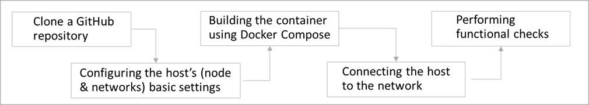

3.1 DGT Environment
+++++++++++++++++++++++++++++++++

The main administrative tasks covered in this section are:

    •	Deployment of individual nodes and entire networks. 

    •	Required functional performance checks. 

    •	Backup and network security management. 

The DGT platform aims to support the network. The DGT Network consists of individual nodes. Each node is a full-featured server solution, equipped with a significant number of services and software components. Even a single node is a complete solution that can support application solutions and can be deployed and tested by a single organization. 

Although the DGT solution can be deployed in any environment that supports the appropriate technology stack (`see 2.7`_), for simplicity, here we examine how to deploy a node for OS Ubuntu in a Docker virtualization environment. 

.. _see 2.7: ../ARCHITECTURE/2.7_Technology_Stack.html
.. _see 3.2: 3.2_Setup_single_Node.html
.. _see 3.4: 3.4_Attach_Node_to_Existing_Network.html
.. _see 3.2.2: 3.2_Setup_single_Node.html#setup-dgt-single-node
.. _see 3.3.2: 3.3_Setup_Private_Public_Network.html
.. _see 2.2: ../ARCHITECTURE/2.2_DGT_Network_Topology.html
.. _see also 3.6: 3.6_DGT_CLI_and_Base_Transaction_Families.html
.. _see 3.6: 3.6_DGT_CLI_and_Base_Transaction_Families.html
.. _see 3.2.4: 3.2_Setup_single_Node.html#nodes-port-configuration
.. _3.6.3: 3.6_DGT_CLI_and_Base_Transaction_Families.html
.. _see 3.5: 3.5_Manage_the_Dashboard.html
.. _see 4.1: ../DEV_GUIDE/4.1_REST_API.html

The deployment process consists of attaining a copy of the appropriate version of the DGT repository, configuring the node's basic settings, building a container using Docker Compose, and connecting the node to the network: 

Below, we consider the deployment scenarios for an individual node (`see 3.2`_), virtual network (`see 3.3.2`_) and physical network (`see 3.4`_). Some preliminary notes on the deployment process: 

•	The process of assembly and connecting to the network is combined and controlled by the “magical” command up.DgtCluster.sh. The DGT Network is organized into groups of nodes (clusters) and each node has its own role (`see 2.2`_).

•	During the deployment process, the basic parameters (such as certificate settings, transaction processing time, etc.) are copied for each node image from the typical configuration (defined by files in the "DGT-Matagami/CORE/etc./” directory). After the node is created and connected, its main parameters are saved in the “DGT-Matagami/dgt_clust” directory (`see also 3.6`_).

•	Each node consists of several services that have separate ports, for which the network access parameters must be configured (`see 3.2.4`_).

•	The entire network must support a single cryptographic system, which defines the signature methods, address system and encryption of transaction bodies. See more details in `3.6.3`_.

•	The DGT network supports a multitude of transaction types, the so called “transaction families.” In its basic configuration, the network supports the following families: 

    • 	dgt-set: the family for managing settings and topology (required for correct network operation),

    • 	xcert: the family for managing certificates (required for deploying closed / private segments), 

    • 	bgt: the test family of token management transactions for testing the network's functionality. 

•	System functionality can be accessed in various ways: through the CLI console/command line (`see 3.6`_), through a special Dashboard component / service (launched from a client computer browser, `see 3.5`_), or through API (`see 4.1`_). All three methods are used for functional checks. 