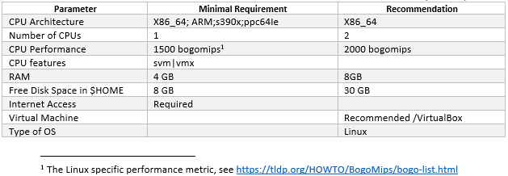
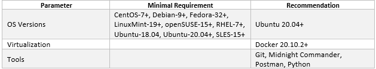
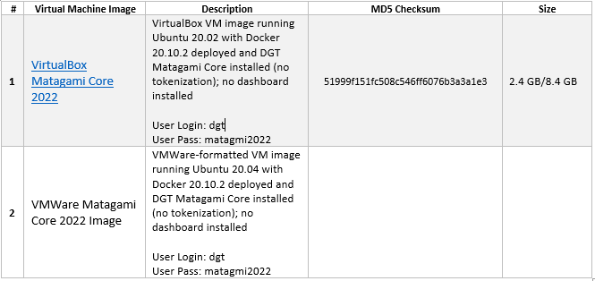
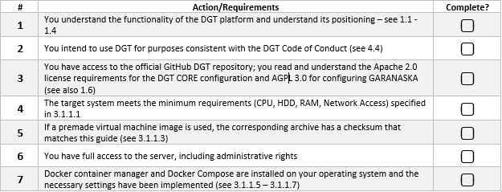

3.1	Setup single Node
+++++++++++++++++++++++++++++++

3.1.1 Server Preparation
===============================

Preparing for working with a node begins with the deployment of the basic software, primarily the operating system. Only one deployment option is discussed below, please contact `partnership@dgt.world`_ for other options and for more information. 

.. _partnership@dgt.world: partnership@dgt.world

3.1.1.1	Minimal Requirements
------------------------------------

The minimal configuration involves deploying a single node with minimal performance and a limited set of node services. 

Regardless of the hardware configuration, the recommended software is presented below in its own minimum configuration: 

3.1.1.2	Deployment Options
------------------------------------

You can also consider the following options for deploying a standalone DGT node:
    •	deploying a single node on a single physical server in a basic configuration;

    •	installing and configuring a node on a virtual machine (VirtualBox, VMWare, Virtual PC);

    •	deploying a scalable solution using multiple servers and clustering technology (request `partnership@dgt.world`_)

    •	use a pre-built virtual machine image (Pre-Built Virtual Machine Images) - `see 3.1.1.3`_;

    •	cloud host deployment (Digital Oceans; currently in development). 

.. _see 3.1.1.3: 3.1_Setup_single_Node.html#using-pre-built-virtual-machine-images

3.1.1.3	Using Pre-Built Virtual Machine Images
-------------------------------------------------

When using this option, you can use a ready-made DGT node image that is available for download onto your computer. You can immediately use the node on your equipment. The following images are available for download:

.. _see 3.1.1.1: 3.1_Setup_single_Node.html#minimal-requirements
.. _3.1.3: 3.1_Setup_single_Node.html#dashboard-setup
.. _VirtualBox: https://www.virtualbox.org/wiki/Downloads
.. _VMware Workstation Player: https://www.vmware.com/products/workstation-player.html
.. _Workstation Pro: https://www.vmware.com/products/workstation-pro/workstation-pro-evaluation.html
.. _WinRar: https://www.win-rar.com/
.. _Getting Started with Ubuntu 16.04: http://files.ubuntu-manual.org/manuals/getting-started-with-ubuntu/16.04/en_US/screen/Getting%20Started%20with%20Ubuntu%2016.04.pdf
.. _VirtualBox.Virtual Networking: https://www.virtualbox.org/manual/ch06.html
.. _VMWare Virtual Networking Concepts: https://www.vmware.com/content/dam/digitalmarketing/vmware/en/pdf/techpaper/virtual_networking_concepts.pdf

Basic steps to get started: 

    •	Get ready: you must have at least 20 GB of free space available on your hard drive (see requirements `see 3.1.1.1`_). You must install a program to support virtual machines (choose depending on the image used: `VirtualBox`_, `VMware Workstation Player`_/ `Workstation Pro`_).

    •	You should be able to unarchive a .rar archive (`WinRar`_ is recommended).

    •	You should have a basic understanding of the Linux system and its commands. Recommended: « `Getting Started with Ubuntu 16.04`_»

    •	Download the selected virtual machine image. Be sure that this is an authentic image - verify the checksum and compare it with the value in the table above. To get the checksum: 

        • 	For the Windows operating system: open the command line interface (Press <*Windows R*>, type ``cmd``  and press <*Enter*>), use the ``cd`` command to navigate to the folder where the file was downloaded and type the command ``certutil -hashfile <file> MD5``, where <file> is replaced by the name of the archive loaded. The screen should display the checksum, which is what you need to compare to the value in the table above. 

        • 	For the Linux operating system: use the <cd> command to navigate to the download folder, type ``md5sum <file>`` to obtain the checksum, and compare the value to the data in the table. 

    •	Expand the archive into a separate folder by using the archiver. Inside it, you will find virtual machine files - the configuration file and the virtual hard disk file. Open the file and edit the network interfaces by using a virtual machine manager (VirtualBox or VMWare). For more details, see `VirtualBox.Virtual Networking`_ and `VMWare Virtual Networking Concepts`_.

    •	Launch the virtual machine and log in using your username and password (see the table above). 

    •	Use the steps described in `3.1.3`_ to control the startup of the node and conduct the necessary testing. 

3.1.1.4	OS Setup and initialization
----------------------------------------

The information presented here and below is focused on installing the Ubuntu operating system and then downloading the DGT source files from GitHub. In case of other parameters, use the necessary clarifications or get advice from `partnership@dgt.world`_

    •	Download an operating system image, such as `Ubuntu 20.04.3`_.

    •	Prepare the server for booting or create a stub for the virtual machine (see the manual for VirtualBox or VMWare). Check the minimum system requirements - `see 3.1.1.1`_. 

    •	Install the operating system using the proper user guide. For example, the official guide is recommended for Ubuntu. Enter the required credentials [#credentials]_, e.g. ``login: dgt, password: matagami2022``.

    •	For the Linux system, install additionally: 

        • 	Open SSH (read `more here`_)
        • 	Midnight Commander (optional, `see here`_)
        • 	Python 3.9 (see `here`_)

.. _Ubuntu 20.04.3: https://releases.ubuntu.com/20.04.3/ubuntu-20.04.3-live-server-amd64.iso?_ga=2.252072585.1036147928.1641525928-1577823777.1641525928
.. _more here: https://linuxize.com/post/how-to-enable-ssh-on-ubuntu-20-04/
.. _see here: https://installati.one/ubuntu/20.04/mc/
.. _here: https://linuxize.com/post/how-to-install-python-3-9-on-ubuntu-20-04/

3.1.1.5	Docker Installation
-------------------------------------
Whether you are downloading files directly from GitHub or using prepared installation files, the most convenient way to assemble the node is to use Docker, a deployment automation and container management software. The following is a sequence of steps to install the Docker container management tool for the Docker operating system. 

    •	Update: ``sudo apt update`` 

    •	Install auxiliary utilities: 

        • 	*apt-transport-https* — activates the transfer of files and data through https. 
        • 	*ca-certificates* — enables verification of security certificates.
        • 	*curl* — utility for accessing web resources.
        • 	*software-properties-common* — activates the ability to use scripts to manage software
            
            .. code-block:: python

                sudo apt install apt-transport-https ca-certificates curl software-properties-common        

    •	Add a GPG key to operate with the official Docker repository:
    
        .. code-block:: python

            curl -fsSL https://download.docker.com/linux/ubuntu/gpg | sudo apt-key add -       

    •	Add the Docker repository into the local list of repositories:

        .. code-block:: python    

            sudo add-apt-repository "deb [arch=amd64] 
            https://download.docker.com/linux/ubuntu $(lsb_release -cs) stable"
    
    •	Re-update the data on operating system's packages:

        .. code-block:: python

            sudo apt update

    •	Install the Docker package itself:

        .. code-block:: python

            sudo apt install docker-ce -y

    •	Initialize the Docker daemon and add it to startup:

        .. code-block:: python    

            sudo systemctl start docker
            sudo systemctl enable docker

More information is available in the `official Docker guide`_

.. _official Docker guide: https://docs.docker.com/engine/install/ubuntu/

3.1.1.6	Setup Docker Compose
-----------------------------------------

.. Warning::
    It is not recommended to use a version of Docker Compose other than 1.21.1 for this version of DGT

Docker Compose is a tool for describing and running multi-container Docker applications. The tool allows users to start, execute, communicate, and close containers with a single command. 

    •	We download the Docker Compose assembly directly from the GitHub repository with the required versions and options: 

        •	-L allows redirects if the file is moved. 
        • 	-o modifies the file name to make it easier to run and specifies the directory to save. 

        .. code-block:: python 

            sudo curl -L 
            "https://github.com/docker/compose/releases/download/1.23.1/docker-compose-$(uname -s)-$(uname -m)" -o /usr/local/bin/docker-compose

        Installation options:

        •	Specify a different version, for example, “1.28.6” instead of “1.23.1”
        •	Install from repository: ``sudo apt-get install docker-compose`` 

    •	After the download is complete, you will need to add execution rights to the downloaded binary file:

        .. code-block:: python 

            sudo chmod +x /usr/local/bin/docker-compose

    •	We check the correctness of the Docker Compose operations:

        .. code-block:: python 

            sudo docker-compose -version

3.1.1.7	Post-Installation actions
------------------------------------------

To support the workability of bath-files, we configure rights and groups:

    •	Create a Docker group:

        .. code-block:: python 

            sudo groupadd docker

    •	Add the current user to the created group:

        .. code-block:: python 

            sudo usermod -aG docker $USER

    •	Activate changes in the group:

        .. code-block:: python 

            newgrp docker

    •	We check the ability to run Docker commands for the current user (without sudo):

        .. code-block:: python 

            docker run hello-world

    •	In case of running Docker commands before adding a user to a group (which is what happens, if we take the checks into account), an error occurs with incorrect rights to the ``~/.docker/.``  directory.    

       .. code-block:: python 

            Warning: Error loading config file: 
            /home/user/.docker/config.json - stat /home/user/.docker/config.json: permission denied

    To fix this, we will use the following commands:

         .. code-block:: python 

            sudo chown "$USER":"$USER" /home/"$USER"/.docker -R
            $ sudo chmod g+rwx "$HOME/.docker" -R

    •	Check again: ``docker run hello-world``.

3.1.1.8	Last checkup
----------------------------------

Before proceeding with the installation of the DGT Node, check that you have completed the necessary preparatory steps and that the system requirements are met:

.. tip:: READ MORE: 

    •   `DGT Technical Deep Dive`_ [10] - a visual representation of the architecture and technology stack of the platform.
    •	`Ubutu Tutorials. The Linux command line for beginners`_ - a guide to using the basic commands for the Linux OS family.
    •	`Licenses and Standards`_ [21] - clarifications of licenses for open source software from the Open Source Initiative (OSI)
    •	`Docker Engine Official Guide`_ - a guide to setting up containerization tools

    .. _DGT Technical Deep Dive: https://dgt.world/docs/DGT_TECHNOLOGY.pdf
    .. _Ubutu Tutorials. The Linux command line for beginners: https://ubuntu.com/tutorials/command-line-for-beginners#1-overview
    .. _Licenses and Standards: https://opensource.org/licenses
    .. _Docker Engine Official Guide: https://docs.docker.com/engine/

3.1.2	Setup DGT Single Node
=======================================

This given installation process describes the necessary steps to deploy a single node. The description is for the CORE configuration, but can be adapted to work with other versions. 

.. _see 1.7: ../INTRODUCTION/1.7_Technology_Roadmap.html
.. _several repositories on GitHub: https://github.com/DGT-Network

    •	First, you need to obtain the system's source code from GitHub. DGT has `several repositories on GitHub`_, each of which corresponds to a certain version of the platform - `see 1.7`_. Please use the last version. This description is provided for the Matagami version in its CORE configuration. To start working, we clone the GitHub repository:

    .. code-block:: python 

        git clone https://github.com/DGT-Network/DGT-Matagami

    As a result of execution, the DGT Matagami/CORE directory is created on the user's home folder (HOME/DGT), from which the server image is built.

    •	Go to the appropriate folder and make sure the files are there:

    .. code-block:: python 

        cd DGT/DGT-Matagami
        cd CORE

    •	We carry out the initial assembly of the node using Docker Compose. Run the assembly (rise) command from the directory in which the assembly is placed (DGT/DGT-Matagami/CORE):

    .. code-block:: python 

        bash upDgtCluster.sh  -G -SC -CB openssl 1 1 

    Here
        -	-G - flag, indicating the need to create a genesis block
        -	-SC - flag indicating that transactions need to be signed by nodes
        -	-CB openssl - the selected type of cryptography (should be consistent with the network that the node belongs to): options are - openssl or bitcoin
        -	1 1 - cluster number and node number in the cluster; for a single node we set “1 1”. Te mapping of the number to a variant notation using segments and clusters is reflected in the dgt.net.map file. 

    The assembly process is quite long, accompanied by the installation of additional packages. A typical output is shown in the figure below:

    .. image:: ../images/figure_01.png
       :align: center

3.1.3	Dashboard setup
=================================

.. _http://192.168.1.53:8003/: http://192.168.1.53:8003/

A “Dashboard” is a special node component that allows you to execute individual node commands, as well as monitor the network. The service is located inside a separate container and may not be available for this node. It is installed separately. 

    The server is installed from the directory into which dgt is loaded with the command:

    .. code-block:: python 

       bash upDgtDashboard.sh -CB openssl

   In case of successful installation, DASHBOARD becomes available for the node's IP:

    ``http://[NODE_IP]:8003/``, for example, `http://192.168.1.53:8003/`_. In response to loading, the browser (Dashboard) displays a panel with main sections presenting information about the network:

   •	Network - presents basic information about the node and the overall topology
   •	Nodes - detailed information on the network topology, node roles, and existing dependencies
   •	Transactions - information on processed transactions
   •	Ledger - a representation of the DAG graph (related packages).
   •	Batches - information on transaction batches
   •	Dev - additional developer tools, including creating test transactions

    .. image:: ../images/figure_02.png
       :align: center

3.1.4	Nodes Port Configuration
========================================

As a result of installing the node in given containers, several services are launched, the ports of which are presented in the table below. Open ports can be checked with the ``sudo ss -ltn`` command. 

    .. image:: ../images/table_6_05.png
       :align: center

3.1.5	Single Node Checkup Procedures
=========================================

3.1.5.1	BGT-based CLI tests
------------------------------------

BGT is a test transaction family that supports abstract tokens within the network. Accessing BGT is possible in various ways, including using the command line interface - CLI. To use the CLI, you need to call bash inside the container. 

    •	We call bash inside the container:

    .. code-block:: python 

       docker exec -it shell-dgt-c1-1 bash

    Inside the container, we execute the command to create a wallet and transfer a sum to it:

    .. code-block:: python 

       bgt set WAL  7777 -url http://api-dgt-c1-1:8108

    As a result, a WAL wallet is created, to which 7777 BGT tokens were credited. 

    •	Checking the list of enrollments: 

    .. code-block:: python 

       bgt list -url http://api-dgt-c1-1:8108

    Sample output:

    .. image:: ../images/figure_04.png
       :align: center

To add funds, conduct transfers, reduce within the bgt family, you can also use the commands (full list bgt -h): 

        -	set - sets the bgt value
        -	inc - increases bgt value
        -	dec - reduces dgt value
        -	trans - transfers tokens from wallet to wallet
        -	show - shows a specific value for this wallet
        -	list - a list of all wallets and their amounts

    •	For example, increasing wallet values is performed by the command:

    .. code-block:: python 

       bgt inc WAL 102 -url http://api-dgt-c1-1:8108

    Sample output:

    .. image:: ../images/figure_05.png
       :align: center

For more information on using the DGT CLI, `see 3.4`_.

    .. _see 3.4: 3.4_DGT_CLI_and_Base_Transaction_Families.html

3.1.5.2	Rest API Test
-------------------------------------

The health check presented above using the BGT transaction family may not be sufficient for a number of situations: the CLI client (`see 3.4`_) interacts with the node through API like any other client, at the same time, this interaction involves the internal (local) network of the node, which does not allow assessing the impact of network effects that are significant when testing distributed interaction. Using direct API calls allows you to: 

    •	Check the passage of transactions through the network.
    •	Access network “costs” in terms of performance and scalability. 

Each node is equipped with an API server that, in the basic configuration, responds on port 8108 (`see 3.1.4`_). To carry out checks, you must ensure the following conditions are met: 

.. _see 3.1.4: 3.1_Setup_single_Node.html#nodes-port-configuration

 .. image:: ../images/table_6_06.png
       :align: center

.. _see 2.3: ../ARCHITECTURE/2.3_DGT_Transactions.html

Verification will be carried out by obtaining a list of transactions for a given node. Even in the case of a newly installed node, this list cannot be empty, since the node initialization procedures include settings for its topology performed through a special transaction family (`see 2.3`_). Depending on the tools you use:

•	When using CURL, type the following in the command line interface:

    .. code-block:: python 

        curl -v [NODE_URL]/transactions

Here the [NODE_URL] - is the tcp-address of the node, including port. For example, 

    .. code-block:: python 

        curl -v http://192.168.1.53:8108/transactions

As a result of executing such a command, the server will return a list of current transactions in JSON format. A typical output is shown below: 

    .. image:: ../images/figure_06.png
     :align: center

•	When using POSTMAN, load the local version, configure the Environment (see Environments tab) by setting the local variable url = NODE_URL (node's IP: Port). Select the new GET command and enter the value: 

    .. code-block:: python 

        {{url}}/transactions

If successful, the command should return a result similar to the one shown in the figure below.

    .. image:: ../images/figure_07.png
     :align: center

3.1.5.3	Checkup the DGT Dashboard
-------------------------------------

.. _see 3.1.3: 3.1_Setup_single_Node.html#dashboard-setup

The standard node comes with a built-in dashboard, which can make health checks much easier. This component is optional and must be run separately - `see 3.1.3`_. Make sure that you have completed the necessary preparatory steps. 

    .. image:: ../images/table_6_07.png
       :align: center

To conduct the testing itself, open your browser and follow these steps:

•	Go to the Dashboard by typing ``http://[NODE_IP]:8003/`` in the address bar. For instance, http://192.168.1.53:8003/. If the service is operational and the network configuration is correct, the main Dashboard page will load: 

    .. image:: ../images/table_6_08.png
     :align: center

•	For further testing, go to the Dev/Batch Creator tab. The presented functionality allows you to create test transactions. Select the following options: 

    -	**Family**: bgt
    -	**Url**: tcp://validator-dgt-c1-1:8108
    -	**Command**: set
    -	**wallet**: WALX
    -	**amount**: 1000

The name of the wallet and the BGT amount can be specified arbitrarily. Execute the transaction (Execute) and if successful, the results of the transaction will be similar to those shown below:

    .. image:: ../images/table_6_09.png
     :align: center

.. rubric:: Footnotes

.. [#credentials] It is recommend that you use your own settings for the account and follow known guides when creating them, such as `NIST Password Guidelines`_,  `ENISA Basic Security practice`_ or `Canada Best Practices for Passphrases and Passwords (ITSAP.30.032)`_

.. _NIST Password Guidelines: https://pages.nist.gov/800-63-3/sp800-63-3.html
.. _ENISA Basic Security practice: https://www.enisa.europa.eu/media/news-items/basic-security-practices-regarding-passwords-and-online-identities
.. _Canada Best Practices for Passphrases and Passwords (ITSAP.30.032): https://www.cyber.gc.ca/sites/default/files/publications/ITSAP.30.32%20-en.pdf