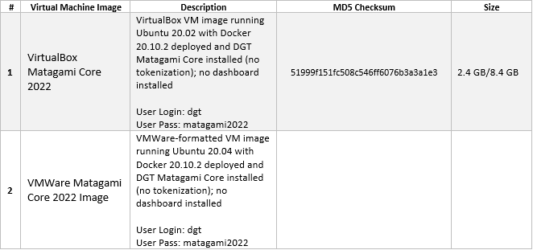

3.1	Setup single Node
+++++++++++++++++++++++++++++++

3.1.1 Server Preparation
===============================

Preparing for working with a node begins with the deployment of the basic software, primarily the operating system. Only one deployment option is discussed below, please contact `partnership@dgt.world`_ for other options and for more information. 

.. _partnership@dgt.world: partnership@dgt.world

3.1.1.1	Minimal Requirements
------------------------------------

The minimal configuration involves deploying a single node with minimal performance and a limited set of node services. 

Regardless of the hardware configuration, the recommended software is presented below in its own minimum configuration: 

.. image:: ../images/table_6_02.PNG

3.1.1.2	Deployment Options
------------------------------------

You can also consider the following options for deploying a standalone DGT node:
    •	deploying a single node on a single physical server in a basic configuration;

    •	installing and configuring a node on a virtual machine (VirtualBox, VMWare, Virtual PC);

    •	deploying a scalable solution using multiple servers and clustering technology (request `partnership@dgt.world`_)

    •	use a pre-built virtual machine image (Pre-Built Virtual Machine Images) - `see 3.1.1.3`_;

    •	cloud host deployment (Digital Oceans; currently in development). 

.. _see 3.1.1.3: 3.1_Setup_single_Node.html#using-pre-built-virtual-machine-images

3.1.1.3	Using Pre-Built Virtual Machine Images
-------------------------------------------------

When using this option, you can use a ready-made DGT node image that is available for download onto your computer. You can immediately use the node on your equipment. The following images are available for download:

.. _see 3.1.1.1: 3.1_Setup_single_Node.html#minimal-requirements
.. _3.1.3: 3.1_Setup_single_Node.html#dashboard-setup
.. _VirtualBox: https://www.virtualbox.org/wiki/Downloads
.. _VMware Workstation Player: https://www.vmware.com/products/workstation-player.html
.. _Workstation Pro: https://www.vmware.com/products/workstation-pro/workstation-pro-evaluation.html
.. _WinRar: https://www.win-rar.com/
.. _Getting Started with Ubuntu 16.04: http://files.ubuntu-manual.org/manuals/getting-started-with-ubuntu/16.04/en_US/screen/Getting%20Started%20with%20Ubuntu%2016.04.pdf
.. _VirtualBox.Virtual Networking: https://www.virtualbox.org/manual/ch06.html
.. _VMWare Virtual Networking Concepts: https://www.vmware.com/content/dam/digitalmarketing/vmware/en/pdf/techpaper/virtual_networking_concepts.pdf

Basic steps to get started: 

    •	Get ready: you must have at least 20 GB of free space available on your hard drive (see requirements `see 3.1.1.1`_). You must install a program to support virtual machines (choose depending on the image used: `VirtualBox`_, `VMware Workstation Player`_/ `Workstation Pro`_).

    •	You should be able to unarchive a .rar archive (`WinRar`_ is recommended).

    •	You should have a basic understanding of the Linux system and its commands. Recommended: « `Getting Started with Ubuntu 16.04`_»

    •	Download the selected virtual machine image. Be sure that this is an authentic image - verify the checksum and compare it with the value in the table above. To get the checksum: 

        • 	For the Windows operating system: open the command line interface (Press <Windows R>, type `cmd`  and press <Enter>), use the cd command to navigate to the folder where the file was downloaded and type the command *certutil -hashfile <file> MD5*, where <file> is replaced by the name of the archive loaded. The screen should display the checksum, which is what you need to compare to the value in the table above. 

        • 	For the Linux operating system: use the <cd> command to navigate to the download folder, type *md5sum <file>* to obtain the checksum, and compare the value to the data in the table. 

    •	Expand the archive into a separate folder by using the archiver. Inside it, you will find virtual machine files - the configuration file and the virtual hard disk file. Open the file and edit the network interfaces by using a virtual machine manager (VirtualBox or VMWare). For more details, see `VirtualBox.Virtual Networking`_ and `VMWare Virtual Networking Concepts`_.

    •	Launch the virtual machine and log in using your username and password (see the table above). 

    •	Use the steps described in `3.1.3`_ to control the startup of the node and conduct the necessary testing. 

3.1.1.4	OS Setup and initialization
----------------------------------------

The information presented here and below is focused on installing the Ubuntu operating system and then downloading the DGT source files from GitHub. In case of other parameters, use the necessary clarifications or get advice from `partnership@dgt.world`_

