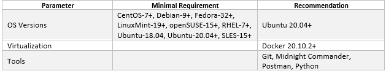
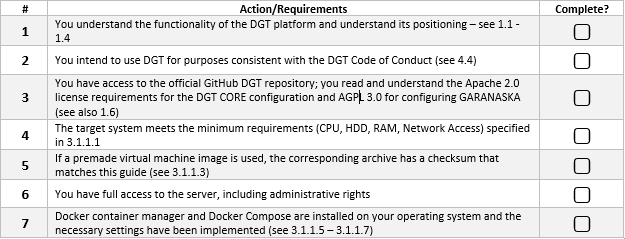
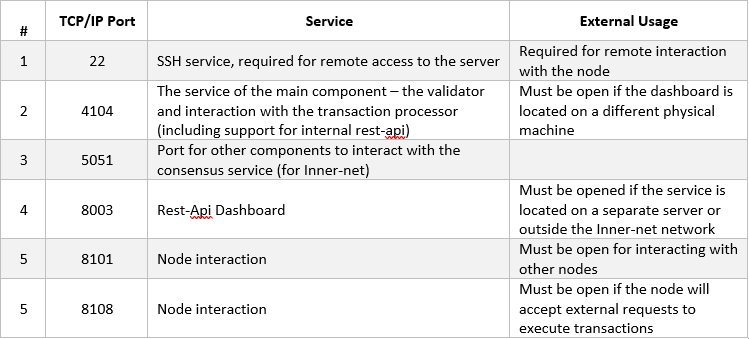

3.2	Setup single Node
+++++++++++++++++++++++++++++++

3.2.1 Server Preparation
===============================

Preparing for working with a node begins with the deployment of the basic software, primarily the operating system. Only one deployment option is discussed below, please contact `partnership@dgt.world`_ for other options and for more information. 

.. _partnership@dgt.world: partnership@dgt.world

3.2.1.1	Minimal Requirements
------------------------------------

The minimal configuration involves deploying a single node with minimal performance and a limited set of node services. 

+--------------------------+---------------------------+-------------------------+
| Parameter                | Minimal Requirement       | Recommendation          |
+==========================+===========================+=========================+
| CPU Architecture         | X86_64; ARM;s390x;ppc64Ie | X86_64                  |
+--------------------------+---------------------------+-------------------------+
| Number of CPUs           | 1                         | 2                       |
+--------------------------+---------------------------+-------------------------+
| CPU Performance          | 1500 bogomips [#bogomips]_| 2000 bogomips           |
+--------------------------+---------------------------+-------------------------+
| CPU features             | svm|vmx                   |                         |
+--------------------------+---------------------------+-------------------------+
| RAM                      | 4 GB                      | 8GB                     |
+--------------------------+---------------------------+-------------------------+
| Free Disk Space in $HOME | 8 GB                      | 30 GB                   |
+--------------------------+---------------------------+-------------------------+
| Internet Access          | Required                  |                         |
+--------------------------+---------------------------+-------------------------+
| Virtual Machine          |                           | Recommended /VirtualBox |
+--------------------------+---------------------------+-------------------------+
| Type of OS               |                           | Linux                   |
+--------------------------+---------------------------+-------------------------+

Regardless of the hardware configuration, the recommended software is presented below in its own minimum configuration: 

3.2.1.2	Deployment Options
------------------------------------

You can also consider the following options for deploying a standalone DGT node:
    •	deploying a single node on a single physical server in a basic configuration;

    •	installing and configuring a node on a virtual machine (VirtualBox, VMWare, Virtual PC);

    •	deploying a scalable solution using multiple servers and clustering technology (request `partnership@dgt.world`_)

    •	use a pre-built virtual machine image (Pre-Built Virtual Machine Images) - `see 3.2.1.3`_;

    •	cloud host deployment (Digital Oceans; currently in development). 

.. _see 3.2.1.3: 3.2_Setup_single_Node.html#using-pre-built-virtual-machine-images

3.2.1.3	Using Pre-Built Virtual Machine Images
-------------------------------------------------

When using this option, you can use a ready-made DGT node image that is available for download onto your computer. You can immediately use the node on your equipment. The following images are available for download:

+---+---------------+---------------+---------------+---------------+
| # | Virtual       | Description   | MD5 Checksum  | Size          |
|   | Machine Image |               |               |               |
+===+===============+===============+===============+===============+
| 1 | `VirtualBox   | VirtualBox VM | 51999f        | 2.4 GB/8.4 GB |
|   | Matagami Core | image running | 151fc508c546f |               |
|   | 2022          |               | f6076b3a3a1e3 |               |
|   | <https://mega | Ubuntu 20.02  |               |               |
|   | .nz/file/JhxW | with Docker   |               |               |
|   | wQAb#FX2X5FoX |               |               |               |
|   | oxmJV6LidPAci | 20.10.2       |               |               |
|   | 6gNdtQAauQ5mg | deployed and  |               |               |
|   | ZasQ4vF-I>`__ | DGT           |               |               |
|   |               |               |               |               |
|   |               | Matagami Core |               |               |
|   |               | installed     |               |               |
|   |               |               |               |               |
|   |               | (no           |               |               |
|   |               | tokenization);|               |               |
|   |               |               |               |               |
|   |               | no dashboard  |               |               |
|   |               | installed     |               |               |
|   |               |               |               |               |
|   |               | User Login:   |               |               |
|   |               | dgt           |               |               |
|   |               |               |               |               |
|   |               | User Pass:    |               |               |
|   |               | matagami2022  |               |               |
+---+---------------+---------------+---------------+---------------+
| 2 | VMWare        | VMW           |               |               |
|   | Matagami Core | are-formatted |               |               |
|   | 2022 Image    | VM image      |               |               |
|   |               |               |               |               |
|   |               | running       |               |               |
|   |               | Ubuntu 20.04  |               |               |
|   |               | with          |               |               |
|   |               |               |               |               |
|   |               | Docker        |               |               |
|   |               | 20.10.2       |               |               |
|   |               | deployed and  |               |               |
|   |               |               |               |               |
|   |               | DGT Matagami  |               |               |
|   |               | Core          |               |               |
|   |               | installed     |               |               |
|   |               |               |               |               |
|   |               | (no           |               |               |
|   |               | tokenization) |               |               |
|   |               |               |               |               |
|   |               | no dashboard  |               |               |
|   |               | installed     |               |               |
|   |               |               |               |               |
|   |               | User Login:   |               |               |
|   |               | dgt           |               |               |
|   |               |               |               |               |
|   |               | User Pass:    |               |               |
|   |               | matagami2022  |               |               |
+---+---------------+---------------+---------------+---------------+

.. _see 3.2.1.1: 3.2_Setup_single_Node.html#minimal-requirements
.. _3.2.3: 3.2_Setup_single_Node.html#dashboard-setup
.. _VirtualBox: https://www.virtualbox.org/wiki/Downloads
.. _VMware Workstation Player: https://www.vmware.com/products/workstation-player.html
.. _Workstation Pro: https://www.vmware.com/products/workstation-pro/workstation-pro-evaluation.html
.. _WinRar: https://www.win-rar.com/
.. _Getting Started with Ubuntu 16.04: http://files.ubuntu-manual.org/manuals/getting-started-with-ubuntu/16.04/en_US/screen/Getting%20Started%20with%20Ubuntu%2016.04.pdf
.. _VirtualBox.Virtual Networking: https://www.virtualbox.org/manual/ch06.html
.. _VMWare Virtual Networking Concepts: https://www.vmware.com/content/dam/digitalmarketing/vmware/en/pdf/techpaper/virtual_networking_concepts.pdf

Basic steps to get started: 

    •	Get ready: you must have at least 20 GB of free space available on your hard drive (see requirements `see 3.2.1.1`_). You must install a program to support virtual machines (choose depending on the image used: `VirtualBox`_, `VMware Workstation Player`_/ `Workstation Pro`_).

    •	You should be able to unarchive a .rar archive (`WinRar`_ is recommended).

    •	You should have a basic understanding of the Linux system and its commands. Recommended: « `Getting Started with Ubuntu 16.04`_»

    •	Download the selected virtual machine image. Be sure that this is an authentic image - verify the checksum and compare it with the value in the table above. To get the checksum: 

        • 	For the Windows operating system: open the command line interface (Press <*Windows R*>, type ``cmd``  and press <*Enter*>), use the ``cd`` command to navigate to the folder where the file was downloaded and type the command ``certutil -hashfile <file> MD5``, where <file> is replaced by the name of the archive loaded. The screen should display the checksum, which is what you need to compare to the value in the table above. 

        • 	For the Linux operating system: use the <cd> command to navigate to the download folder, type ``md5sum <file>`` to obtain the checksum, and compare the value to the data in the table. 

    •	Expand the archive into a separate folder by using the archiver. Inside it, you will find virtual machine files - the configuration file and the virtual hard disk file. Open the file and edit the network interfaces by using a virtual machine manager (VirtualBox or VMWare). For more details, see `VirtualBox.Virtual Networking`_ and `VMWare Virtual Networking Concepts`_.

    •	Launch the virtual machine and log in using your username and password (see the table above). 

    •	Use the steps described in `3.2.3`_ to control the startup of the node and conduct the necessary testing. 

3.2.1.4	OS Setup and initialization
----------------------------------------

The information presented here and below is focused on installing the Ubuntu operating system and then downloading the DGT source files from GitHub. In case of other parameters, use the necessary clarifications or get advice from `partnership@dgt.world`_

    •	Download an operating system image, such as `Ubuntu 20.04.3`_.

    •	Prepare the server for booting or create a stub for the virtual machine (see the manual for VirtualBox or VMWare). Check the minimum system requirements - `see 3.2.1.1`_. 

    •	Install the operating system using the proper user guide. For example, the official guide is recommended for Ubuntu. Enter the required credentials [#credentials]_, e.g. ``login: dgt, password: matagami2022``.

    •	For the Linux system, install additionally: 

        • 	Open SSH (read `more here`_)
        • 	Midnight Commander (optional, `see here`_)
        • 	Python 3.9 (see `here`_)
        •	SFTP/FTP for enabling remote access to server files (`see also here`_)

.. _Ubuntu 20.04.3: https://releases.ubuntu.com/20.04.3/ubuntu-20.04.3-live-server-amd64.iso?_ga=2.252072585.1036147928.1641525928-1577823777.1641525928
.. _more here: https://linuxize.com/post/how-to-enable-ssh-on-ubuntu-20-04/
.. _see here: https://installati.one/ubuntu/20.04/mc/
.. _here: https://linuxize.com/post/how-to-install-python-3-9-on-ubuntu-20-04/
.. _see also here: https://ubuntu.com/server/docs/service-ftp

3.2.1.5	Docker Installation
-------------------------------------
Whether you are downloading files directly from GitHub or using prepared installation files, the most convenient way to assemble the node is to use Docker, a deployment automation and container management software. The following is a sequence of steps to install the Docker container management tool for the Docker operating system. 

    •	Update: ``sudo apt update`` 

    •	Install auxiliary utilities: 

        • 	*apt-transport-https* — activates the transfer of files and data through https. 
        • 	*ca-certificates* — enables verification of security certificates.
        • 	*curl* — utility for accessing web resources.
        • 	*software-properties-common* — activates the ability to use scripts to manage software
            
            .. code-block:: python

                sudo apt install apt-transport-https ca-certificates curl software-properties-common        

    •	Add a GPG key to operate with the official Docker repository:
    
        .. code-block:: python

            curl -fsSL https://download.docker.com/linux/ubuntu/gpg | sudo apt-key add -       

    •	Add the Docker repository into the local list of repositories:

        .. code-block:: python    

            sudo add-apt-repository "deb [arch=amd64] 
            https://download.docker.com/linux/ubuntu $(lsb_release -cs) stable"
    
    •	Re-update the data on operating system's packages:

        .. code-block:: python

            sudo apt update

    •	Install the Docker package itself:

        .. code-block:: python

            sudo apt install docker-ce -y

    •	Initialize the Docker daemon and add it to startup:

        .. code-block:: python    

            sudo systemctl start docker
            sudo systemctl enable docker

More information is available in the `official Docker guide`_

.. _official Docker guide: https://docs.docker.com/engine/install/ubuntu/

3.2.1.6	Setup Docker Compose
-----------------------------------------

.. Warning::
    It is not recommended to use a version of Docker Compose other than 1.21.1 for this version of DGT

Docker Compose is a tool for describing and running multi-container Docker applications. The tool allows users to start, execute, communicate, and close containers with a single command. 

    •	We download the Docker Compose assembly directly from the GitHub repository with the required versions and options: 

        •	-L allows redirects if the file is moved. 
        • 	-o modifies the file name to make it easier to run and specifies the directory to save. 

        .. code-block:: python 

            sudo curl -L 
            "https://github.com/docker/compose/releases/download/1.23.1/docker-compose-$(uname -s)-$(uname -m)" -o /usr/local/bin/docker-compose

        Installation options:

        •	Specify a different version, for example, “1.28.6” instead of “1.23.1”
        •	Install from repository: ``sudo apt-get install docker-compose`` 

    •	After the download is complete, you will need to add execution rights to the downloaded binary file:

        .. code-block:: python 

            sudo chmod +x /usr/local/bin/docker-compose

    •	We check the correctness of the Docker Compose operations:

        .. code-block:: python 

            sudo docker-compose -version

3.2.1.7	Post-Installation actions
------------------------------------------

To support the workability of bath-files, we configure rights and groups:

    •	Create a Docker group:

        .. code-block:: python 

            sudo groupadd docker

    •	Add the current user to the created group:

        .. code-block:: python 

            sudo usermod -aG docker $USER

    •	Activate changes in the group:

        .. code-block:: python 

            newgrp docker

    •	We check the ability to run Docker commands for the current user (without sudo):

        .. code-block:: python 

            docker run hello-world

    •	In case of running Docker commands before adding a user to a group (which is what happens, if we take the checks into account), an error occurs with incorrect rights to the ``~/.docker/.``  directory.    

       .. code-block:: python 

            Warning: Error loading config file: 
            /home/user/.docker/config.json - stat /home/user/.docker/config.json: permission denied

    To fix this, we will use the following commands:

         .. code-block:: python 

            sudo chown "$USER":"$USER" /home/"$USER"/.docker -R
            $ sudo chmod g+rwx "$HOME/.docker" -R

    •	Check again: ``docker run hello-world``.

3.2.1.8	Last check before launch
----------------------------------

Before proceeding with the installation of the DGT Node, check that you have completed the necessary preparatory steps and that the system requirements are met:

.. tip:: READ MORE: 

    •   `DGT Technical Deep Dive`_ [10] - a visual representation of the architecture and technology stack of the platform.
    •	`Ubutu Tutorials. The Linux command line for beginners`_ - a guide to using the basic commands for the Linux OS family.
    •	`Licenses and Standards`_ [21] - clarifications of licenses for open source software from the Open Source Initiative (OSI)
    •	`Docker Engine Official Guide`_ - a guide to setting up containerization tools

    .. _DGT Technical Deep Dive: https://dgt.world/docs/DGT_TECHNOLOGY.pdf
    .. _Ubutu Tutorials. The Linux command line for beginners: https://ubuntu.com/tutorials/command-line-for-beginners#1-overview
    .. _Licenses and Standards: https://opensource.org/licenses
    .. _Docker Engine Official Guide: https://docs.docker.com/engine/

3.2.2	Setup DGT Single Node
=======================================

This given installation process describes the necessary steps to deploy a single node. The description is for the CORE configuration, but can be adapted to work with other versions. 

.. _see 1.7: ../INTRODUCTION/1.7_Technology_Roadmap.html
.. _several repositories on GitHub: https://github.com/DGT-Network

    •	First, you need to obtain the system's source code from GitHub. DGT has `several repositories on GitHub`_, each of which corresponds to a certain version of the platform - `see 1.7`_. Please use the last version. This description is provided for the Matagami version in its CORE configuration. To start working, we clone the GitHub repository:

    .. code-block:: python 

        git clone https://github.com/DGT-Network/DGT-Matagami

    As a result of execution, the DGT Matagami/CORE directory is created on the user's home folder (HOME/DGT), from which the server image is built.

    •	Go to the appropriate folder and make sure the files are there:

    .. code-block:: python 

        cd DGT/DGT-Matagami
        cd CORE
    
    As a result of deploying a node, some of the general settings will be copied into the node's configuration. To edit them and add more settings:

    •	Access the directory with the system settings:

         .. code-block:: python 

            cd DGT-Matagami/CORE/etc

    •	Set up the parameters of the node's certificate, which will be created when connecting to the network. For that, edit the parameters of the ``certificate.json`` file, setting up the correct names for the administrator's country, region, and e-mail. To connect to private segments, you must register these parameters: 

        .. code-block:: python 

           nano certificate.json

    .. image:: ../images/figure_10.png
       :align: center 

    •	Edit the network's parameters (dgt.net.map, dgt.conf.static, entry_points.json) - `see 3.6`_ (skip this step if setting up a single node). 
    
    .. _see 3.6: 3.6_DGT_CLI_and_Base_Transaction_Families.html

    After defining the settings, move towards building the node's image. 

    •	We carry out the initial assembly of the node using Docker Compose. Run the assembly (rise) command from the directory in which the assembly is placed (DGT/DGT-Matagami/CORE):

    .. code-block:: python 

        bash upDgtCluster.sh  -G -SC -CB openssl 1 1 

    Here
        -	-G - flag, indicating the need to create a genesis block
        -	-SC - flag indicating that transactions need to be signed by nodes
        -	-CB openssl - the selected type of cryptography (should be consistent with the network that the node belongs to): options are - openssl or bitcoin
        -	1 1 - cluster number and node number in the cluster; for a single node we set “1 1”. Te mapping of the number to a variant notation using segments and clusters is reflected in the dgt.net.map file. 

    The assembly process is quite long, accompanied by the installation of additional packages. A typical output is shown in the figure below:

    .. image:: ../images/figure_01.png
       :align: center

.. warning::  

    The full assembly process is conducted only when updating the home directory of the project (DGT-Matagami/CORE). Afterwards, a simplified process of launching the relevant container is conducted. 

3.2.3	Dashboard setup
=================================

.. _http://192.168.1.53:8003/: http://192.168.1.53:8003/

A “Dashboard” is a special node component that allows you to execute individual node commands, as well as monitor the network. The service is located inside a separate container and may not be available for this node. It is installed separately. 

    The server is installed from the directory into which dgt is loaded with the command:

    .. code-block:: python 

       bash upDgtDashboard.sh -CB openssl

   In case of successful installation, DASHBOARD becomes available for the node's IP:

    ``http://[NODE_IP]:8003/``, for example, `http://192.168.1.53:8003/`_. In response to loading, the browser (Dashboard) displays a panel with main sections presenting information about the network:

   •	Network - presents basic information about the node and the overall topology
   •	Nodes - detailed information on the network topology, node roles, and existing dependencies
   •	Transactions - information on processed transactions
   •	Ledger - a representation of the DAG graph (related packages).
   •	Batches - information on transaction batches
   •	Dev - additional developer tools, including creating test transactions

    .. image:: ../images/figure_02.png
       :align: center

When installing a node, use the following checklist to ensure the right sequence of steps for guaranteeing success: 

+---+--------------------+-----------------------+---------+
| # | Action             | Description           |Complete?|
+===+====================+=======================+=========+
| 1 | Check Environment  | Check the             | ▢       |
|   |                    | environment's         |         |
|   | Setup              | configuration,        |         |
|   |                    | including Ubuntu      |         |
|   |                    |                       |         |
|   |                    | installation (at      |         |
|   |                    | least 20.04), ssh     |         |
|   |                    | service installation, |         |
|   |                    |                       |         |
|   |                    | Docker version        |         |
|   |                    | (docker -version),    |         |
|   |                    |                       |         |
|   |                    | Docker Compose        |         |
|   |                    | version               |         |
|   |                    | (docker-compose       |         |
|   |                    | -version)             |         |
+---+--------------------+-----------------------+---------+
| 2 | Clone DGT Version  | Check for the DGT     | ▢       |
|   |                    | version (or clone     |         |
|   |                    | github:               |         |
|   |                    |                       |         |
|   |                    | «git clone            |         |
|   |                    | https://github.com    |         |
|   |                    | /DGT-Network/         |         |
|   |                    | DGT-Matagami»)        |         |
+---+--------------------+-----------------------+---------+
| 3 | Build version with | Go to the DGT's home  | ▢       |
|   |                    | directory (for        |         |
|   | upDgtCluster.sh    | example,              |         |
|   |                    |                       |         |
|   |                    | cd                    |         |
|   |                    | DGT-Matagami/CORE/).  |         |
|   |                    |                       |         |
|   |                    | Build the main kernel |         |
|   |                    | version with the      |         |
|   |                    |                       |         |
|   |                    | «bash upDgtCluster.sh |         |
|   |                    | -G -SC -CB openssl 1  |         |
|   |                    | 1»                    |         |
|   |                    |                       |         |
|   |                    | command.              |         |
|   |                    |                       |         |
|   |                    | After loading         |         |
|   |                    | additional components |         |
|   |                    | and the build         |         |
|   |                    | process,              |         |
|   |                    |                       |         |
|   |                    | the container startup |         |
|   |                    | process should        |         |
|   |                    | complete              |         |
|   |                    |                       |         |
|   |                    | successfully,         |         |
|   |                    | including the launch  |         |
|   |                    | of the validator,     |         |
|   |                    |                       |         |
|   |                    | bgt, xcert, settings, |         |
|   |                    | and API services.     |         |
+---+--------------------+-----------------------+---------+
| 4 | Start DGT CLI      | Check the ability to  | ▢       |
|   |                    | access the DGT CLI    |         |
|   |                    | using the             |         |
|   |                    |                       |         |
|   |                    | command «docker exec  |         |
|   |                    | -it shell-dgt-c1-1    |         |
|   |                    | bash».                |         |
|   |                    |                       |         |
|   |                    | In case of successful |         |
|   |                    | access to the node's  |         |
|   |                    |                       |         |
|   |                    | command interpreter,  |         |
|   |                    | return to the         |         |
|   |                    | operating             |         |
|   |                    |                       |         |
|   |                    | system command line   |         |
|   |                    | (“exit” command).     |         |
+---+--------------------+-----------------------+---------+
| 5 | Build Dashboard    | Build the DGT         | ▢       |
|   |                    | Dashboard service     |         |
|   |                    | using the             |         |
|   |                    |                       |         |
|   |                    | «bash                 |         |
|   |                    | upDgtDashboard.sh -CB |         |
|   |                    | openssl» command.     |         |
|   |                    |                       |         |
|   |                    | After the assembly is |         |
|   |                    | completed, open       |         |
|   |                    |                       |         |
|   |                    | the Dashboard service |         |
|   |                    | page                  |         |
|   |                    | (`http://[N           |         |
|   |                    | ODE_IP]:8003/ <http:/ |         |
|   |                    | /[NODE_IP]:8003/>`__) |         |
|   |                    |                       |         |
|   |                    | in the browser window |         |
|   |                    | of your workstation.  |         |
|   |                    |                       |         |
|   |                    | The browser page      |         |
|   |                    | should load in        |         |
|   |                    | response.             |         |
+---+--------------------+-----------------------+---------+

3.2.4	Nodes Port Configuration
========================================

As a result of installing the node in given containers, several services are launched, the ports of which are presented in the table below. Open ports can be checked with the ``sudo ss -ltn`` command. 

 .. image:: ../images/figure_11.png
       :align: center

DGT nodes can use various network ports for communication, which are configured through environment variables set up by the upDgtCluster.sh script in the DGT director (for example, /DGT-Matagami/CORE):

    •	API=8108 (API service)
    •	COMP=4104 (supporting transaction families)
    •	NET=8101 (supporting the network)
    •	CONS=5051 (consensus service)

3.2.5	Single Node Check
=========================================

3.2.5.1	BGT-based CLI tests
------------------------------------

BGT is a test transaction family that supports abstract tokens within the network. Accessing BGT is possible in various ways, including using the command line interface - CLI. To use the CLI, you need to call bash inside the container. 

    •	We call bash inside the container:

    .. code-block:: python 

       docker exec -it shell-dgt-c1-1 bash

    Inside the container, we execute the command to create a wallet and transfer a sum to it:

    .. code-block:: python 

       bgt set WAL  7777 -url http://api-dgt-c1-1:8108

    As a result, a WAL wallet is created, to which 7777 BGT tokens were credited. 

    •	Checking the list of enrollments: 

    .. code-block:: python 

       bgt list -url http://api-dgt-c1-1:8108

    Sample output:

    .. image:: ../images/figure_04.png
       :align: center

To add funds, conduct transfers, reduce within the bgt family, you can also use the commands (full list bgt -h): 

        -	set - sets the bgt value
        -	inc - increases bgt value
        -	dec - reduces dgt value
        -	trans - transfers tokens from wallet to wallet
        -	show - shows a specific value for this wallet
        -	list - a list of all wallets and their amounts

    •	For example, increasing wallet values is performed by the command:

    .. code-block:: python 

       bgt inc WAL 102 -url http://api-dgt-c1-1:8108

    Sample output:

    .. image:: ../images/figure_05.png
       :align: center

For more information on using the DGT CLI, `see 3.6`_.

    .. _see 3.6: 3.6_DGT_CLI_and_Base_Transaction_Families.html

3.2.5.2	Rest API Test
-------------------------------------

The health check presented above using the BGT transaction family may not be sufficient for a number of situations: the CLI client (`see 3.6`_) interacts with the node through API like any other client, at the same time, this interaction involves the internal (local) network of the node, which does not allow assessing the impact of network effects that are significant when testing distributed interaction. Using direct API calls allows you to: 

    •	Check the passage of transactions through the network.
    •	Access network “costs” in terms of performance and scalability. 

Each node is equipped with an API server that, in the basic configuration, responds on port 8108 (`see 3.2.4`_). To carry out checks, you must ensure the following conditions are met: 

+---+----------------------------------------------------+-----------+
| # | Action/Requirements                                | Complete? |
+===+====================================================+===========+
| 1 | The node is deployed in the local network in       | ▢         |
|   | accordance with the instructions (see 3.1)         |           |
+---+----------------------------------------------------+-----------+
| 2 | The node has open ports as per requirements (see   | ▢         |
|   | 3.1.4)                                             |           |
+---+----------------------------------------------------+-----------+
| 3 | The overall health of the node has been verified   | ▢         |
|   | internally using the CLI (see 3.1.5.1)             |           |
+---+----------------------------------------------------+-----------+
| 4 | The node has an IP address accessible from the     | ▢         |
|   | local/external network. For an Ubuntu system, use  |           |
|   | the official guide for configuring and checking    |           |
|   | system network interfaces (see [22])               |           |
+---+----------------------------------------------------+-----------+
| 5 | You have API testing tools installed and prepared. | ▢         |
|   |                                                    |           |
|   | Recommended:                                       |           |
|   |                                                    |           |
|   | -  `CURL <https://curl.se/>`__ is a command-line   |           |
|   |    utility for interacting with URL-based serves   |           |
|   |    available for Linux and Windows operating       |           |
|   |    systems (see `user                              |           |
|   |    guide <https://everything.curl.dev/>`__)        |           |
|   |                                                    |           |
|   | -  `POSTMAN <https://www.postman.com/>`__ is a     |           |
|   |    comprehensive API testing and development       |           |
|   |    solution. See the official guide for using the  |           |
|   |    system.                                         |           |
+---+----------------------------------------------------+-----------+

.. _see 3.2.4: 3.2_Setup_single_Node.html#nodes-port-configuration

.. _see 2.3: ../ARCHITECTURE/2.3_DGT_Transactions.html

Verification will be carried out by obtaining a list of transactions for a given node. Even in the case of a newly installed node, this list cannot be empty, since the node initialization procedures include settings for its topology performed through a special transaction family (`see 2.3`_). Depending on the tools you use:

•	When using CURL, type the following in the command line interface:

    .. code-block:: python 

        curl -v [NODE_URL]/transactions

Here the [NODE_URL] - is the tcp-address of the node, including port. For example, 

    .. code-block:: python 

        curl -v http://192.168.1.53:8108/transactions

As a result of executing such a command, the server will return a list of current transactions in JSON format. A typical output is shown below: 

    .. image:: ../images/figure_06.png
     :align: center

•	When using POSTMAN, load the local version, configure the Environment (see Environments tab) by setting the local variable url = NODE_URL (node's IP: Port). Select the new GET command and enter the value: 

    .. code-block:: python 

        {{url}}/transactions

If successful, the command should return a result similar to the one shown in the figure below.

    .. image:: ../images/figure_07.png
     :align: center

3.2.5.3	Check the DGT Dashboard
-------------------------------------

.. _see 3.2.3: 3.2_Setup_single_Node.html#dashboard-setup

The standard node comes with a built-in dashboard, which can make health checks much easier. This component is optional and must be run separately - `see 3.2.3`_. Make sure that you have completed the necessary preparatory steps. 

    .. image:: ../images/table_6_07.PNG
       :align: center

To conduct the testing itself, open your browser and follow these steps:

•	Go to the Dashboard by typing ``http://[NODE_IP]:8003/`` in the address bar. For instance, http://192.168.1.53:8003/. If the service is operational and the network configuration is correct, the main Dashboard page will load: 

    .. image:: ../images/table_6_08.PNG
     :align: center

•	For further testing, go to the Dev/Batch Creator tab. The presented functionality allows you to create test transactions. Select the following options: 

    -	**Family**: bgt
    -	**Url**: tcp://validator-dgt-c1-1:8108
    -	**Command**: set
    -	**wallet**: WALX
    -	**amount**: 1000

The name of the wallet and the BGT amount can be specified arbitrarily. Execute the transaction (Execute) and if successful, the results of the transaction will be similar to those shown below:

    .. image:: ../images/table_6_09.PNG
     :align: center

3.2.5.4	Unified single node check
-------------------------------------

To verify that a single node installation works correctly, please use the following test to verify that the node is available and working: 

+---+-----------------------+-----------------------+--------------+
| # | Action                | Description           | Is Complete? |
+===+=======================+=======================+==============+
| 1 | Check Environment     | Make sure the system  | ▢            |
|   |                       | is deployed and       |              |
|   |                       | assembled without     |              |
|   |                       | errors, including the |              |
|   |                       | core services and     |              |
|   |                       | Dashboard.            |              |
|   |                       |                       |              |
|   |                       | Use the appropriate   |              |
|   |                       | procedures (see       |              |
|   |                       | 3.1.3, 3.1.5.3 )      |              |
+---+-----------------------+-----------------------+--------------+
| 2 | Check CLI with BGT    | Navigate to the       | ▢            |
|   |                       | command line of the   |              |
|   | Transaction Family    | deployed node with    |              |
|   |                       | the                   |              |
|   |                       |                       |              |
|   |                       | «docker exec -it      |              |
|   |                       | shell-dgt-c1-1 bash»  |              |
|   |                       | command.              |              |
|   |                       |                       |              |
|   |                       | The command line      |              |
|   |                       | prompt will change to |              |
|   |                       | «root…:/project/dgt». |              |
|   |                       |                       |              |
|   |                       | Run the command for   |              |
|   |                       | creating the WALLET1  |              |
|   |                       | wallet                |              |
|   |                       |                       |              |
|   |                       | (or any other name,   |              |
|   |                       | if this wallet was    |              |
|   |                       | created earlier:      |              |
|   |                       |                       |              |
|   |                       | «bgt set WALLET1      |              |
|   |                       | 1000».                |              |
|   |                       |                       |              |
|   |                       | If successful, repeat |              |
|   |                       | the command for       |              |
|   |                       | creating a second     |              |
|   |                       | wallet:               |              |
|   |                       |                       |              |
|   |                       | «bgt set WALLET2      |              |
|   |                       | 1000».                |              |
|   |                       |                       |              |
|   |                       | Transfer tokens from  |              |
|   |                       | the first wallet to   |              |
|   |                       | the second:           |              |
|   |                       |                       |              |
|   |                       | «bgt trans            |              |
|   |                       | WALLET1 500 WALLET2». |              |
|   |                       |                       |              |
|   |                       | Print a list of       |              |
|   |                       | wallets for the bgt   |              |
|   |                       | family using the      |              |
|   |                       | command: «bgt list».  |              |
|   |                       |                       |              |
|   |                       | The output should     |              |
|   |                       | reflect the list of   |              |
|   |                       | wallets and the       |              |
|   |                       | wallet balances that  |              |
|   |                       | changed due to the    |              |
|   |                       | transfer:             |              |
|   |                       |                       |              |
|   |                       | «WALLET1:             |              |
|   |                       | BGT_token=500         |              |
|   |                       | WALLET2: BGT_token =  |              |
|   |                       | 1500»                 |              |
+---+-----------------------+-----------------------+--------------+
| 3 | Check CLI Command to  | Without leaving the   | ▢            |
|   |                       | CLI of the node,      |              |
|   | show all transactions | enter the command to  |              |
|   |                       | display the list of   |              |
|   |                       | transactions:         |              |
|   |                       |                       |              |
|   |                       | «dgt transaction      |              |
|   |                       | list».                |              |
|   |                       |                       |              |
|   |                       | The command should    |              |
|   |                       | display a list of all |              |
|   |                       | transactions in the   |              |
|   |                       | DAG.                  |              |
+---+-----------------------+-----------------------+--------------+
| 4 | Check CLI/xcert       | To check the          | ▢            |
|   |                       | processing of         |              |
|   |                       | certificates, we use  |              |
|   |                       | the command of their  |              |
|   |                       | creation based on the |              |
|   |                       | key generated         |              |
|   |                       | earlier:              |              |
|   |                       |                       |              |
|   |                       | «xcert set            |              |
|   |                       | /project/dgt          |              |
|   |                       | /etc/certificate.json |              |
|   |                       | -user                 |              |
|   |                       | /root/                |              |
|   |                       | .dgt/keys/root.priv». |              |
|   |                       |                       |              |
|   |                       | The successful output |              |
|   |                       | of the certificate's  |              |
|   |                       | contents guarantees   |              |
|   |                       | the performance of    |              |
|   |                       | the corresponding     |              |
|   |                       | functionality.        |              |
|   |                       |                       |              |
|   |                       | The output of “xcert  |              |
|   |                       | list” certificates    |              |
|   |                       | should provide for    |              |
|   |                       | outputting data       |              |
|   |                       | created on the base   |              |
|   |                       | of the certificate's  |              |
|   |                       | template.             |              |
|   |                       |                       |              |
|   |                       | Close the CLI console |              |
|   |                       | with the “exit”       |              |
|   |                       | command.              |              |
+---+-----------------------+-----------------------+--------------+
| 5 | API Quering           | To check the          | ▢            |
|   |                       | functionality of the  |              |
|   |                       | API, they must be     |              |
|   |                       | accessed through the  |              |
|   |                       | appropriate client    |              |
|   |                       | tool.                 |              |
|   |                       |                       |              |
|   |                       | On the external       |              |
|   |                       | machine, open the     |              |
|   |                       | command line          |              |
|   |                       | interface (or the     |              |
|   |                       | POSTMAN toolkit).     |              |
|   |                       |                       |              |
|   |                       | Execute the listing   |              |
|   |                       | of transactions:      |              |
|   |                       | «curl -v              |              |
|   |                       | http://[NODE_IP]:     |              |
|   |                       |   8108/transactions». |              |
|   |                       |                       |              |
|   |                       | This command displays |              |
|   |                       | a list of             |              |
|   |                       | transactions based on |              |
|   |                       | the network settings. |              |
|   |                       |                       |              |
|   |                       | Additionally, let's   |              |
|   |                       | display the           |              |
|   |                       | information for each  |              |
|   |                       | separate transaction. |              |
|   |                       |                       |              |
|   |                       | To do this, copy the  |              |
|   |                       | Transaction_ID        |              |
|   |                       |                       |              |
|   |                       | (header_signature -   |              |
|   |                       | 128-144-digit code in |              |
|   |                       | the form of           |              |
|   |                       | “3046022…d630fd”)     |              |
|   |                       |                       |              |
|   |                       | for any transaction   |              |
|   |                       | randomly selected     |              |
|   |                       | from the list.        |              |
|   |                       |                       |              |
|   |                       | The output of         |              |
|   |                       | transaction details   |              |
|   |                       | is given by the       |              |
|   |                       | command               |              |
|   |                       |                       |              |
|   |                       | «curl -v              |              |
|   |                       | http://[NODE_IP]:     |              |
|   |                       | 8108/transactions/    |              |
|   |                       | TRANSACTION_ID».      |              |
+---+-----------------------+-----------------------+--------------+
| 6 | Dashboard Check       | Checking the health   | ▢            |
|   |                       | of the Dashboard      |              |
|   |                       | component (if it was  |              |
|   |                       | installed) is carried |              |
|   |                       | out through the       |              |
|   |                       | operations of the bgt |              |
|   |                       | family.               |              |
|   |                       |                       |              |
|   |                       | Load the Dashboard in |              |
|   |                       | the browser of the    |              |
|   |                       | client computer:      |              |
|   |                       |                       |              |
|   |                       | http://[NODE_IP]:8003/|              |
|   |                       |                       |              |
|   |                       | Open the «Dev/Batch   |              |
|   |                       | Creator» tab.         |              |
|   |                       |                       |              |
|   |                       | Select the following  |              |
|   |                       | in the Create Batch   |              |
|   |                       | section:              |              |
|   |                       |                       |              |
|   |                       | Family = bgt; Url =   |              |
|   |                       | «tcp://val            |              |
|   |                       | idator-dgt-c1-1:8101» |              |
|   |                       | , command = «set».    |              |
|   |                       |                       |              |
|   |                       | In the additional     |              |
|   |                       | fields, enter the     |              |
|   |                       | information about the |              |
|   |                       | transaction:          |              |
|   |                       |                       |              |
|   |                       | wallet = “DSHBTEST”,  |              |
|   |                       | amount = “700”        |              |
|   |                       |                       |              |
|   |                       | Press execute and you |              |
|   |                       | should receive a link |              |
|   |                       | to the transaction    |              |
|   |                       | status:               |              |
|   |                       |                       |              |
|   |                       | http://[NODE_IP]      |              |
|   |                       | /batch_statuses?      |              |
|   |                       | amount=700&cmd=set... |              |
|   |                       |                       |              |
|   |                       | Press the Refresh     |              |
|   |                       | button and you should |              |
|   |                       | receive the           |              |
|   |                       | information on the    |              |
|   |                       | transaction's status; |              |
|   |                       | if successful, it     |              |
|   |                       | will display:         |              |
|   |                       | COMITTED.             |              |
|   |                       |                       |              |
|   |                       | Copy the transaction  |              |
|   |                       | ID:                   |              |
|   |                       |                       |              |
|   |                       | «“id”: "3046022100…»  |              |
|   |                       | (just the ID itself)  |              |
|   |                       |                       |              |
|   |                       | Head over to the      |              |
|   |                       | “Transactions” tab,   |              |
|   |                       | find the transaction  |              |
|   |                       | of the bgt family     |              |
|   |                       | among the first       |              |
|   |                       | lines, highlight it,  |              |
|   |                       | and in the pop-up     |              |
|   |                       | window, check the     |              |
|   |                       | transaction id        |              |
|   |                       | against the           |              |
|   |                       | “header_signature”    |              |
|   |                       | field.                |              |
+---+-----------------------+-----------------------+--------------+
| 7 | Direct BGT API        | Check the processing  | ▢            |
|   |                       | of the bgt            |              |
|   |                       | transaction (by       |              |
|   |                       | direct API access)    |              |
|   |                       | with the endpoint run |              |
|   |                       | and curl utility.     |              |
|   |                       |                       |              |
|   |                       | Create a new wallet:  |              |
|   |                       |                       |              |
|   |                       | curl                  |              |
|   |                       | "http://[NODE_IP]:    |              |
|   |                       | 8108/run?family=bgt&u |              |
|   |                       | rl=tcp%3A%2F%2Fvalida |              |
|   |                       | tor-dgt-c1-1%3A8101&c |              |
|   |                       | md=set&wallet=TESTWAL |              |
|   |                       | LET&amount=1000" [3]_ |              |
|   |                       |                       |              |
|   |                       | In case of success,   |              |
|   |                       | you should receive a  |              |
|   |                       | check with a link to  |              |
|   |                       | success.              |              |
|   |                       |                       |              |
|   |                       | The status of the     |              |
|   |                       | created wallet is     |              |
|   |                       | checked by the        |              |
|   |                       | command:              |              |
|   |                       |                       |              |
|   |                       | curl                  |              |
|   |                       | "http:                |              |
|   |                       | //192.168.1.166:8108/ |              |
|   |                       | run?family=bgt&cmd=sh |              |
|   |                       | ow&wallet=TESTWALLET" |              |
|   |                       |                       |              |
|   |                       | In case of success, a |              |
|   |                       | link to the wallet    |              |
|   |                       | and its value are     |              |
|   |                       | returned:             |              |
|   |                       |                       |              |
|   |                       | «”value”:1000»        |              |
|   |                       |                       |              |
|   |                       | Reduce the number of  |              |
|   |                       | tokens in the wallet  |              |
|   |                       | by a sum exceeding    |              |
|   |                       | the one set before:   |              |
|   |                       |                       |              |
|   |                       | curl                  |              |
|   |                       | "http://[NODE_IP]:    |              |
|   |                       | 8108/run?family=      |              |
|   |                       | bgt&cmd=dec&wallet=TE |              |
|   |                       | STWALLET&amount=1200" |              |
|   |                       |                       |              |
|   |                       | This transaction      |              |
|   |                       | returns a check with  |              |
|   |                       | a display of the      |              |
|   |                       | transaction (batch)   |              |
|   |                       | ID:                   |              |
|   |                       |                       |              |
|   |                       | “id=                  |              |
|   |                       | 3045022100fcc9        |              |
|   |                       | cc0e1e5cda651e5b33…”. |              |
|   |                       |                       |              |
|   |                       | Verify the            |              |
|   |                       | operation's status:   |              |
|   |                       |                       |              |
|   |                       | curl                  |              |
|   |                       | "http://[NODE_IP]:    |              |
|   |                       | 8108/batch_st         |              |
|   |                       | atuses?id=[BATCH_ID]" |              |
|   |                       |                       |              |
|   |                       | With the output ID,   |              |
|   |                       | the result is         |              |
|   |                       | provided with the     |              |
|   |                       | “INVALID” status.     |              |
|   |                       |                       |              |
|   |                       | The wallet status is  |              |
|   |                       | checked with the      |              |
|   |                       | command               |              |
|   |                       |                       |              |
|   |                       | curl                  |              |
|   |                       | "http://[NODE_IP]:8108|              |
|   |                       | /run?family=bgt&cmd=sh|              |
|   |                       | ow&wallet=TESTWALLET" |              |
|   |                       |                       |              |
|   |                       | It should display an  |              |
|   |                       | unchanged balance of  |              |
|   |                       | 1000 BGT              |              |
+---+-----------------------+-----------------------+--------------+

.. rubric:: Footnotes

.. [#bogomips] The Linux specific performance metric, `see page`_

.. [#credentials] It is recommend that you use your own settings for the account and follow known guides when creating them, such as `NIST Password Guidelines`_,  `ENISA Basic Security practice`_ or `Canada Best Practices for Passphrases and Passwords (ITSAP.30.032)`_

.. [3]
   The transaction call includes the encoded URL of the node

    .. _see page: https://tldp.org/HOWTO/BogoMips/bogo-list.html
    .. _NIST Password Guidelines: https://pages.nist.gov/800-63-3/sp800-63-3.html
    .. _ENISA Basic Security practice: https://www.enisa.europa.eu/media/news-items/basic-security-practices-regarding-passwords-and-online-identities
    .. _Canada Best Practices for Passphrases and Passwords (ITSAP.30.032): https://www.cyber.gc.ca/sites/default/files/publications/ITSAP.30.32%20-en.pdf