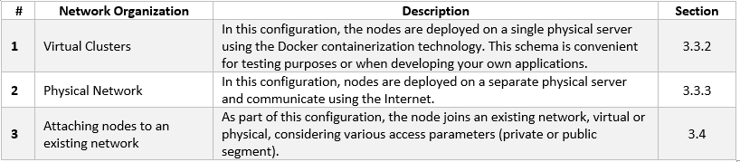
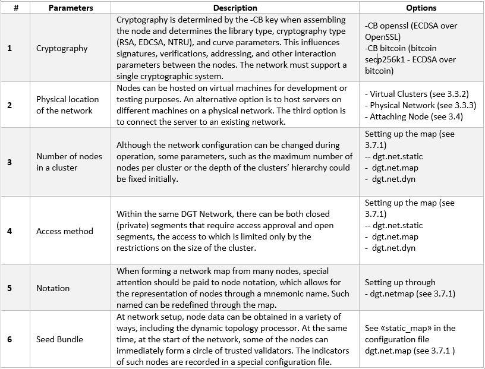

3.3	Setup Private/Public Network
+++++++++++++++++++++++++++++++++++++++

3.3.1	Network launch preparation
========================================

.. _see 2.2: ../ARCHITECTURE/2.2_DGT_Network_Topology.html
.. _see 3.7: 3.7_Adjust_DGT_Settings.html
.. _see 3.5: 3.5_Manage_the_Dashboard.html
.. _see 3.7.3: 3.7_Adjust_DGT_Settings.html#cryptography-adjusting

Network deployment is the installation of several nodes interacting with each other. Unlike peer-to-peer network, a DGT network can have a set structure that is thought out and configured in advance (`see 2.2`_). The following items must be considered: 

 •	Setting up the network topology. In DGT, nodes are combined into special groups (clusters) that allow to achieve the F-BFT consensus and a significant scaling effect. Clusters can be hierarchical, allowing for the creation of additional network structures with different levels of trust. Segments are another network structure that define the access permissions to the network. Closed (private) segments require access permissions though certificates. Public segments allow free connection. Although several settings allow the network to change dynamically, its initial organization must be well thought out. 

 •	The first nodes entering the network are the so-called seed-configuration (the static core of the network) and must have a certain level of trust that allows them to recognize public keys before making changes in the topology. The initial (seed) topology of the network, including the hierarchy of clusters and segments, can be described by special configuration files (`see 3.7`_).

 •	DGT allows for flexible management of cryptographic libraries at the network planning stage. However, once the network is launched, the addressing in the distributed (DAG) ledger, transaction signatures, and hidden message encoding must be unified. Therefore, select the correct node assembly parameters before proceeding to launch (  `see 3.7.3`_).

 •	Connecting to the network and forming closed clusters requires registration and correct processing of certificates in X.509 format (binding a public key to a specific node). `See 3.7.3`_ for details. 

 •	The payload within the network is essentially the exchange of transactions. DGT supports different families of transactions, some of which are built-in (such as #topology, handled by the topology processor; #xcert supporting certificate processing; #bgt token testing transactions - `see 3.5`_). Network deployment assumes that all nodes within one cluster support the corresponding family of transactions. 

 •	Connection nodes to the network is carried out through a special type of transactions processed by the topology processor. Like all transactions, they can be rejected and go through a consensus mechanism. 

The following options for network deployment and organization of network are available: 

Select the network parameters prior to deployment: 

3.3.2	A Virtual Cluster
====================================

3.3.2.1	Setup Virtual Nodes
-----------------------------------

.. _see 3.2.1.8: 3.2_Setup_single_Node.html#last-check-before-launch
.. _see 3.7.1: 3.7_Adjust_DGT_Settings.html#dgt-topology

Deploying a virtual cluster is the easiest way to run multiple nodes within a single virtual server (using Docker technology):

    •	Deployment of a small network of several nodes for test purposes.

    •	Designing your own subnet, which is expected to include nodes of different types.

    •	Development and testing of applied solutions based on the DGT platform. 

The basic steps to initializing a virtual cluster are as follows: 

    •	Prepare the server in accordance with the requirements listed in 3.1 (including setting up the operational system, Docker, Docker Compose, and the necessary instruments). Verify the correctness of the configuration (`see 3.2.1.8`_).

    •	Download the latest version of dgt through the “git clone” command:

    .. code-block:: python

            git clone https://github.com/DGT-Network/DGT-Matagami       

    As a result of execution, the DGT-Matagami/CORE directory is formed in the home folder of the user (HOME/DGT), from which the image of the cluster's servers is built. 

    •	Go to the relevant folder and make sure the files are present:

    .. code-block:: python

            cd DGT-Matagami 
            cd CORE

    •	Go to the CORE/etc directory to set up settings. First, you need to edit the template for creating certificates: etc/certificate.json, by specifying the relevant parameters, including country, region, administrator e-mail and others:

    .. code-block:: python

            nano certificate.json

    •	Set up the topology (`see 3.7.1`_):

    .. code-block:: python

            nano dgt.net.map
    
    You need to pay attention to the lists of nodes within each cluster, as well as the «static_map» parameter, which will define the Seed Bundle (the static core of the network [1]_); `see 3.7.1`_:

    .. image:: ../images/figure_12.png
        :align: center

   •	Use the «bash upDgtCluster.sh N M» command to sequentially build each of the nodes included in the Seed bundle (if necessary, install the Dashboard for a given node): 

     .. code-block:: python

            bash upDgtCluster.sh -G -SC -CB openssl NumCluster NumNode

    Here:

        -	-G - flag indicates the necessity of creating a genesis-block 
        -	-SC - flag indicates the requirement of having nodes sign transactions
        -	-CB openssl - indicates the selectable type of cryptography (must be consistent with the network to which the node belongs). Options include openssl or bitcoin
        -	NumCluster NumNode - cluster number and the node number in the cluster. For the first node, we set “1 1”. The mapping of the number to a notation variant using segments and clusters is reflected in the dgt.net.map file. 

For example, to bring up four nodes located in two clusters, we use the following set of commands: 

.. code-block:: python

            bash upDgtCluster.sh  -G -SC -CB openssl 1 1

            bash upDgtDashboard.sh -CB openssl

            bash upDgtCluster.sh -G -SC -CB openssl 1 2
            
            bash upDgtCluster.sh -G -SC -CB openssl 1 3

            bash upDgtCluster.sh  -G -SC -CB openssl 2 1

As a result of this set of commands, two clusters with four nodes will be created. To create another configuration, `see 3.7.1`_.

3.3.2.2	Virtual Cluster Evaluation
----------------------------------------

After deploying a cluster, you need to perform the initial health check. 

 •	Using the API, we poll the available nodes [2]_:

    .. code-block:: python

            curl -v http://[SERVER_IP]:8108/peers

    Where SERVER_IP is the address of the virtual machine hosting the nodes. The typical output of the command is shown in the figure below: 

    .. image:: ../images/figure_13.png
        :align: center

   Note that the nodes have received different ports and URLs:

    -	tcp://validator-dgt-c1-1:8101 [3]_
    -	tcp://validator-dgt-c1-2:8102
    -	tcp://validator-dgt-c1-3:8103
    -	tcp://validator-dgt-c2-1:8201

    •	Let's display the complete network topology, indicating the status of each of the nodes:

        .. code-block:: python

            curl -v “http://[SERVER_IP]:8108/topology

    A typical output contains a complete network map, for which the active nodes receive the «node_state: active» status, as well as an indication of the corresponding roles: plink, leader, etc. 

        .. image:: ../images/figure_14.png
          :align: center

    •	Verifying the interaction via console

    Each of the running nodes has its own console. This allows for the testing of a scenario where one of the nodes executes commands and then the results are checked through another node. 

        -	Log in to the console of the first node and create some bgt wallets. Then exit the console: 

         .. code-block:: python

            docker exec -it shell-dgt-c1-1 bash
            bgt set wallet_1 1000
            bgt set wallet_2 700
            exit

        -	Through the console of another node, we display a list of wallets: 

            .. code-block:: python

                docker exec -it shell-dgt-c1-3 bash
                bgt list

            The output should confirm data synchronization between nodes. The output contains commands that display a list of wallets created through the console of another node. 

            .. image:: ../images/figure_15.png
                :align: center

    •	Checking node status via Dashboard

        If the Dashboard component is installed, checking the status of the nodes can be performed using the browser of the client computer: 

         .. code-block:: python

                http://[SERVER_IP]:8003/ -> Nodes

         .. image:: ../images/figure_16.png
                   :align: center

    •	Querying the API of each of the nodes allows for finer testing of transaction execution. 

By default, each of the nodes is associated with its own API service that executes the appropriate commands (endpoints, `see 4.1`_). If a virtual cluster is launched, the corresponding IP servers have the same [SERVER_IP], however, they use different ports, the correspondence of which to a given node is determined by the «upDgtCluster.sh» [4]_  file, `see also 3.2.4`_. The default ports ([API] parameter) are as follows: 

    -	Cluster 1 Node 1: 8108
    -	Cluster 1 Node 2: 8109
    -	Cluster 1 Node 3: 8110
    -	Cluster 2 Node 1: 8208

.. _see 4.1: ../DEV_GUIDE/4.1_REST_API.html
.. _see also 3.2.4: 3.2_Setup_single_Node.html#nodes-port-configuration
.. _see 4.1.9.2: ../DEV_GUIDE/4.1_REST_API.html#bgt-set-wallet

To check using the API, execute the command to display a list of wallets for the first node, change the amount on the first one by using the “inc” increasing command, then check the balance through an API of another node. We call the API from the client system using the curl utility. 

We display the status of wallets on the first node and make an increase (we use the previously created test wallets wallet_1 and wallet_2; if they are not available, you must also execute the commands to create them (`see 4.1.9.2`_):

    .. code-block:: python

       curl "[SERVER_IP]:8108/run?family=bgt&url=tcp%3A%2F%2Fvalidator-dgt-c1-1%3A8101&cmd=list"
       curl "[SERVER_IP]:8108/run?family=bgt&url=tcp%3A%2F%2Fvalidator-dgt-c1-1%3A8101&cmd=inc&wallet=wallet_1&amount=100"

We check the received amount through another node:

    .. code-block:: python

       curl "[SERVER_IP]:8208/run?family=bgt&url=tcp%3A%2F%2Fvalidator-dgt-c2-1%3A8201&cmd=list"

Expected result: even though the command was sent to the node in the second cluster, the data is synchronized, and the correct amount was displayed for the first wallet. 

3.3.3	A Physical Network
==============================

3.3.3.1	Network Deployment Preparation
---------------------------------------------

3.3.3.2	Setup a physical network
------------------------------------

3.3.3.3	DGT Network Example
------------------------------------

.. rubric:: Footnotes

.. [1] In this example, the “static_map” parameter defines three nodes within the first cluster, while the fourth node was assigned to the second cluster. These nodes form the initial network configuration (Seed Bundle). Six clusters are given, within which the corresponding nodes and rules for their naming are defined.

.. [2] Hereinafter, SERVER_IP designates the IP of the virtual machine

.. [3] is not displayed, since the request was made to this node

.. [4] Cluster port data can also be set in the configuration file, `see 3.7.1`_ for more information