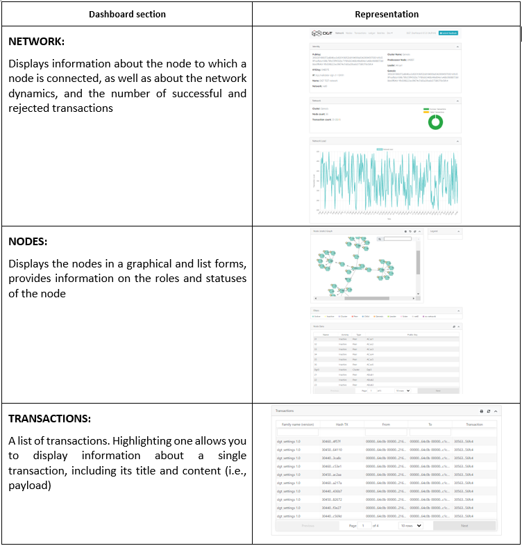
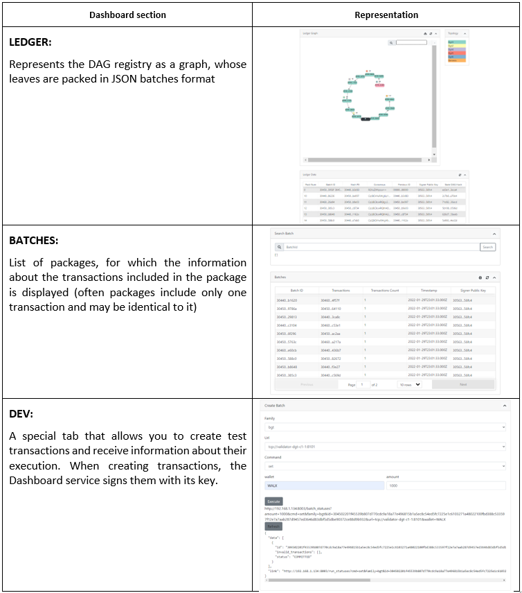

3.5	Manage the Dashboard
+++++++++++++++++++++++++++++++++++++++

.. _see 3.8.3: 3.8_DGT_Maintenance.html#network-performance

DGT Dashboard - is a separate node component that is installed to obtain additional information about a node or the entire network. Key features include:

    •	It represents a separate service with its own API (including a Web application, port 8003)

    •	Interacts with a node at a low level; runs in a single instance on a single physical server and can connect to any of the network nodes, thus providing an appropriate overview of the network

    •	Allows you to view the network structure (topology), the status of the nodes, transactions, and the general view of DAG)

    •	Allows you to execute and display the status of commands for test families of transactions 

The main purpose of the service is to test and monitor the network. If you have a systematic monitoring task, use the Grafana service (`see 3.8.3`_). Service sections are represented by the following tabs: 

