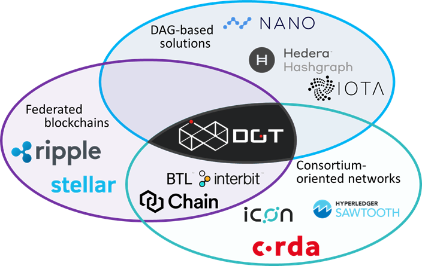

2.1	System Overview
++++++++++++++++++++++++++++

2.1.1	DLT Design Principles
===================================

The DGT Platform is a Distributed Ledger Technology (DLT) class software, deployed to solve objectives of distributed data storage, their processing and presentation to end users of TCP/IP networks. Although the taxonomy of DLT solutions is still evolving, the figure below presents one of the well-known attempts to systematize the concepts of this area [24]. It is easiest to imagine the DLT network as a distributed database (albeit only within certain limits, as the technology is much more versatile than just a data organization and storage system) in which there are N participants (nodes), each of which has its own copy of the data. 

The entire network is organized in such a way as to ensure the integrity and consistency of data, provided that many participants have access to the record. The main properties of such systems include: 

 •	**Distribution** - means the physical separation of the network, whereas the nodes may be or are dispersed across locations and interact through the network. 

 •	**Decentralization** - means that different entities act as owners (managers) of nodes and that their interests and motivations may not coincide. 

 •	**Encryption** - the network, its operation, as well as data integrity are supported by various technical mechanisms, but the quintessential one is cryptography, which includes hashing (one-way conversion), digital signature, encryption, and similar functions. 

 •	**Immutability** - data entered into a distributed database is stored unchanged. It is impossible to change any record without changing the rest. In this case, historical records will be the same for all participants and imperceptible substitution of records is impossible or extremely unlikely. 

 •	**Tokenization** - the ability to represent the value of work in the form of elementary components and distribute the value and costs of maintaining the network among all participants. Tokenization makes it possible to give economic meaning to distributed networks and complements the technological components of DLT systems. 

Each of the listed properties is not binary and may involve a whole range of solutions. For example, the level of distribution may vary from nodes located in a single virtual space to nodes separated geographically. Moreover, if nodes play the same role and completely coincide in terms of functionality and processes, then this would be a peer-to-peer (P2P) network. But there are other types of networks, such as DGT that uses a hierarchical network with different node roles (`see 2.2`_). Decentralization can also take different degrees, depending on the rules for connecting nodes to the network:

 •	**Public networks**. All nodes are free to join the existing network. 

 •	**Private networks**. All nodes are controlled by one or few organizations that delegated network administration to one party. In such a network, outsider nodes cannot join the network without an explicit approval/authorization procedure. 

 •	**Consortium-based networks**. In such networks, network participation may be relatively free, but subject to certain conditions. This is similar to the real situation with private banks: each business participant may want to organize their own bank, but they must receive a license and accumulate some capital that would guarantee its operation. 

 •	**Hybrid networks**. These networks have different segments with varying access policies. Some are free to join (public), some are closed and are either private or consortium based. 

    .. image:: ../images/figure_30.png
        :align: center

One of the most important components of decentralized systems are the rules of consensus, a mechanism for agreeing on various data that determines which of the records (transactions) will ultimately be entered into a distributed database - a ledger (`see 2.3`_). Decentralized distributed systems do not have a built-in mechanism for synchronizing data at the time of their creation. In the asynchronous network model, the arrival of messages at a given point in the network is not guaranteed within a limited time, which may result in the possible loss of messages. Back in 1985, Fisher, Lynch and Paterson published a theorem about the impossibility of a distributed consensus (the FLP Impossibility, the Fisher-Lynch-Paterson result). According to this theorem, a deterministic asynchronous system can have no more than two of the following three properties:  

.. _see 2.2: 2.2_DGT_Network_Topology.html
.. _see 2.3: 2.3_DGT_Transactions.html
.. _section 2.3: 2.3_DGT_Transactions.html
.. _paragraph 2.5: 2.5_F-BFT_Consensus.html
.. _see 2.1.3: 2.1_System_Overview.html#dgt-approach

 •	**Safety** - security, the guarantee that all results are correct and identical on all nodes. 

 •	**Liveness** - vitality, guaranteed completion of transaction, that is, nodes that never fail to provide a result 

 •	**Fault Tolerance** - a system can survive the simultaneous failure of one or more nodes

The F-BFT algorithm that forms the foundation of the DGT platform is designed in such a way, that it prefers Fault Tolerance and Safety to Liveness. Such decisions lead to an appropriate system architecture designed to support asynchronous transaction processing. The limitations of the security model resulting from the architecture are discussed in `section 2.3`_.

Today, the name BLOCKCHAIN has become all-encompassing for a wide range of distributed and decentralized solutions. The name is based on a specific way of organizing data - literally in a chain of blocks. Classical blockchain systems pack transactions into blocks (through the so-called Merkle Tree), which in turn are interconnected, so that each subsequent block contains the hash of the header of the previous block. This data organization provides an easy check of data integrity and makes it impossible to replace previously saved transactions. Features of data organization are discussed in `paragraph 2.5`_,  here we shall restrict ourselves to general remarks on approaches to data storage: 

 •	Transactions are the main object for storage. These can be structured in terms of (1) the transaction header containing important meta-information (sometimes also called the envelope); and (2) the transaction body containing the actual content of the transaction. 

 •	The very first records (the first whole block when storing data in the block chain) are called genesis records (genesis block). Unlike all subsequent records, these initial ones do not contain references to any previous ones and are formed relatively arbitrarily. 

 •	The set of records combined with cryptographic functions form a ledger (Ledger), which reflect the general state of the networks' nodes - State. In this context, blockchain-like systems are State machines that move from state to state. 

 •	The general approach to data storage is done through the Merkle Tree, which is a complete binary tree. Its top leaf branches contain hashes from data blocks, while inner branches contain hashes from adding values in child branches. Such an approach allows to get a fingerprint of all transactions in the block and to effectively verify it. 

Other technical solutions can be used in addition (even in conjunction) to the Merkle Tree. These may include Patricia Trees, which (unlike Merkle ones) store data in the top leaf branches, while each non-leafed node is represented by a unique string symbol that identifies data (similar to hash tables).  

Other solutions are improvements of the Merkle Tree, such as the Prefix Merkle Tree (used by Ethereum, whereas a dynamic key is added for nodes that allows for fast sum calculations); or HashFusion (a Hewlett Packards Labs solution that allows for the calculation of hash function values to be done in stages). Each header block may contain several Merkle Trees or their equivalents, for example, for storing transactions, receipts (results of accepted transactions), or states. 

 •	Storing data in a chain of blocks (blockchain) is not the only option. Common approaches include:

        •	Blockchain (classic option, see [24] for example)
        •	Directed graph (Directed Acyclic Graph, DAG) - used by the DGT Platform, see [25]
        •	BlockMatrix (see [26])

In terms of architecture, there are comparisons of centralized and decentralized systems that are used to solve similar problems. The main attributes of solutions for different types of systems are presented in the table below.  

    .. image:: ../images/table_9_01.PNG
        :align: center

The above list of architectural features allows for the conclusion that there is no panacea, the only solution right for any objective and that there is a need to take the business model into account when forming an effective solution. This approach leads to the formation of general principles for the design of decentralized systems, which are followed in DGT:

    •	Decentralized distributed systems based on the DGT platform greatly depend on business requirements. An effective solution requires building a special business model. 

    •	Comparing DLT solutions is a difficult task. The most important decision is to support open standards and focus on the community that supports solutions of this class.

    •	Tokenization is mandatory for open and consortium-based solutions, as it allows you to control the distribution of the costs. 

    •	Blockchain solutions do not provide automatic security for data and require additional protection of end applications, as well as additional mechanisms for protecting private data. 

    •	System scaling is directly related to its protocol (consensus) and must be considered in balance with security. 

    •	The classical principles of building software systems are also true for decentralized solutions. Complex solutions require detailed design and justification. Modularity of solutions is a mandatory requirement for their architecture. 

    •	The architecture of private and consortium-based solutions should include configuration and support management systems or community adoption of the technology. 

2.1.2	Reference Architecture
===================================

The reference architecture involves the description of the most important decisions and components of the corresponding software system. The DGT platform supports standardized cryptography, networking, and data storage components that correlate with the most important published models of distributed architectures, primarily [9] and [10]. In accordance with these principles, the architecture of distributed systems can be represented by basic layers:

    .. image:: ../images/figure_31.png
        :align: center

Within the system architecture, DGT [1]_  clearly delineates horizontal layers, which correspond to the classical architecture of complex information systems. On the other hand, vertical partitioning highlights the user view (tiers). The FIRST TIER is the platform itself, the DGT CORE (`see 2.1.3`_). The SECOND TIER is the extension of functionality. The DAPPs tier is for end applications. Together the last two form the DGT GARANASKA subsystem. 

    .. image:: ../images/figure_32.png
        :align: center

2.1.3	DGT Approach
===================================

2.1.3.1	Platform Domain
----------------------------

DGT is positioned as a platform for distributed and decentralized computing:

    •	**Distributed computing** refers to the ability to process information simultaneously and asynchronously on different components of the system.
    •	**Decentralized computing** refers to the varying owners / managers of the nodes (each node is managed by an independent organization). The overall behaviour of the node (its availability, level of privacy, economic priorities) reflect the interests of its owner.  

Distribution and decentralization can have different degrees, so that the operation of the system is possible in an incompletely decentralized and only partially distributed network. DGT's approach: 

.. _see 2.1.3.2: 2.1_System_Overview.html#process-domain
.. _see 2.3: 2.3_DGT_Transactions.html

    •	DGT is called a **platform** in a sense that the system processes data regardless of a specific application task. To solve a specific task, setting up a family of transactions is required, as well as an addition of an application client. 

    •	DGT is build on the **Sawtooth framework**. This means that the DGT platform inherits the main technical solutions of Hyperledger Sawtooth and supports limited backward compatibility but organizes node interaction and data processing differently (`see 2.1.3.2`_ for the differences). 

    •	DGT functions as a **network consisting of nodes**. In essence, DGT software is the **software of a typical node** that provides interaction with other nodes, data validation, and insertion of new data into the storage (ledger, also called DAG or State). 

    •	DGT aims to support **consortium-based networks**. This means that connecting a node to the network is possible under certain conditions (**“anchor security”**). In the simplest terms, this may mean verifying whether the node is whitelisted, but it can also refer, for example, to checking for a sufficient amount of cryptocurrency on an external network (ex. Ethereum), or validating a certificate. The degree of network's openness varies depending on the implementation of the anchor mechanism: from completely open (public) to completely closed (private). 

    •	Nodes are organized into groups, also called federations or **clusters**. The initial interaction is carried out through the connections between the nodes and one dedicated node in the cluster (**LEADER**). The Leader collects data from transaction checks at each node. Such checks are called **“votes”**. If the number of affirmative votes exceeds some given threshold (either a simply majority, or 2/3 + 1 of the voting nodes for PBFT), then the transaction is considered approved in the cluster and awaits **arbitration** performed outside the cluster (an additional check).

    •	Within the cluster, nodes communicate with each other via dedicated channels, also called **permalinks**.

    •	The core functionality of the network is the **exchange of messages between nodes**, also called **transactions**. Such transactions are checked for correctness and compliance with the specific conditions, after which they are added to the general ledger - DAG. 

    •	The ledger is a **distributed database** (storage) that stores only verified records linked by links to previous records. Such a ledger is immutable (you cannot “pull out” or change an entry without changing the entire ledger”. 

The complex structure of information exchange in the system is aimed at providing a united information space for different nodes and forming a single reliable copy of the data, free from accidental and deliberate errors. Such objectives arise when the system operates without a single center. The logic of checking each transaction and distributing it to the entire system (ledger synchronization) is described by a system of rules called **consensus**. 

It is assumed that accidental or intentional actions of individual nodes in a heterogenous (uncontrolled) environment may violate the integrity of data in the ledger. Such actions are called Byzantine attacks, according to a well-known mathematical `Byzantine generals' problem`_. In the general case, the problem of resistance to a wide range of Byzantine attacks is considered unsolvable. But its solution can be obtained in various approximations through private algorithms - consensuses. A large number of such consensuses is known, for example, `PoW`_ (Proof Of Work), `PoS`_ (Proof Of Stake), etc.

The consensus used in DGT is called F-BFT (Federated Byzantine Fault Tolerance), which is a generalization of the PBFT algorithm (`see 2.3`_).  

.. _Byzantine generals' problem: https://en.wikipedia.org/wiki/Byzantine_fault
.. _PoW: https://en.wikipedia.org/wiki/Proof_of_work
.. _PoS: https://en.wikipedia.org/wiki/Proof_of_stake

2.1.3.2	Process Domain
--------------------------------

As indicated above, the essence of the platform is to ensure the exchange of messages between nodes and their integration (consolidation) in a single immutable ledger. 

For the exchange of such transactions to occur, the following conditions must be met: 

 •	A network of nodes has been formed. Each node is defined by **its own key pair** (private and public key). The number of nodes is enough to form a consensus [2]_.

 •	There is at least **one meaningful family of transactions**, for which a transaction structure is defined: its header and description of the transaction body. 

 •	**Consensus (validation) rules have been defined** depending on the transaction family [3]_.

 •	The transaction storage (DAG, ledger, ledger, State) has been configured properly, so that the rules for inserting transactions into the graph have been defined (there is an explicitly stated vertex to which a transaction is added).  

Transactions are generated by clients - autonomous agents that interact with nodes though API. Before sending, each client “signs” a transaction with a pair of keys (private and public) based on the elliptic cryptography mechanism (ECDSA). When sending a transaction, the client does not wait for an immediate response, instead the transaction is accepted by the network within a limited time (transactions are sent asynchronously, the client receives the transaction ID and if it has been accepted by the system, he can request its status for a given ID). 

If there are multiple nodes, the following roles can be defined in terms of processing a transaction:
 •	**INITIATOR/PRIMARY** - the node that initiates the transaction (for example, though a client that interacts with it). 

 •	**LEADER** - the node that collects transactions within its cluster (by “counting” the number of votes by the nodes of the cluster). 

 •	**REPLICA/VALIDATOR** - the node that votes on a given transaction within the cluster. 

 •	**ARBITRATOR** - node(s) outside of the cluster that verify the vote within it and add the transaction to the ledger [4]_.

The general scenario for working with transactions begins with its verification on the client, client signature and transmission to the PRIMARY node. The PRIMARY node verifies the transaction and submits it for voting to the current leader. The leader sends it within the cluster to other validators. The transaction goes through a cycle typical for PBFT (`see 2.3`_).

**Validators** check the transaction according to a stack of rules set by the transaction processor (for example, if a certain number of tokens is transferred from one account to another, then checks may include the validity of the account, sufficient balance, etc.) In case of a positive check, the node votes for the transaction by signing it and returning it to the leader. The leader independently maintains a stack of signatures and rejections from the voting validators. 

If the number of votes (signatures) from the nodes exceeds the specified number of such votes (⅔, ⅔ +1 or 50%+1 [5]_), the transaction is considered approved within the cluster and the leader transmits it to the arbitrator. The leader expands the transaction, by including all signatures of the validator nodes that voted for it in its header and then sends it to the arbitrator. This action ends this voting round. Within the framework of the topology, a leader change period (in number of rounds) may be defined, after which the leader will change, and another node will be chosen randomly among the validators to act as leader.  

The arbitrator is selected from among the nodes outside the cluster according to the algorithm specified by the topology processor (see below). The arbitrator verifies the transaction, including the validity of the signatures of the voting nodes and inserts the transactions into DAG. The flow of the transaction is shown in the diagram below. In more complex situations, when an ORACLE is present, the transaction may require additional arbitration, in which case the first arbitrator selects a new arbitrator. 

If for some reason, the transaction is “frozen” (ex. the initiator temporarily lost connection with the network), then a time-out period is provided, after which the transaction is “removed” from the queue and not sent to the network. 

After a transaction is inserted into the ledger, a version of the ledger on the arbitrator node differs from that of the other nodes. The process of synchronization starts immediately: the ledger is distributed along the permalinks either up (to the current leader) or down (from the leader to the validators). 

Since the network works asynchronously, the client that initiated the transaction does not receive an immediate response. Instead, they can proactively check on the transaction status by receiving a “check” on its completion. 

The diagram below shows the general flow of the transaction:   

    .. image:: ../images/table_9_02.PNG
        :align: center

Backward compatibility with Sawtooth provides the following benefits:

 •	Inheritance of significant functionality that has been security audited and verified in terms of performance. 

 •	The use of a consistent technology stack allows DGT to focus on developing distinctive features that most closely match the target characteristics of application scenarios, such as those primarily necessary for establishing digital ecosystems. 

 •	Easy integration of such components as Sabre and other modules with high potential. 

2.1.4	 Unique contribution
=================================

.. _Consortium-based networks: https://www.mycryptopedia.com/consortium-blockchain-explained/
.. _based on DAG: https://www.researchgate.net/publication/330880551_A_Comparative_Analysis_of_DAG-Based_Blockchain_Architectures
.. _Stellar: https://www.stellar.org/papers/stellar-consensus-protocol.pdf
.. _compromise of network safety versus liveness: https://www.scs.stanford.edu/~dm/blog/safety-vs-liveness.html

DGT is a distributed ledger technology that allows organizing interactions between organizations (Business) within the framework of a consortium-based approach. A number of properties derived from the F-BFT consensus make it possible to position DGT as a platform for ecosystems, which can implement complex B2B2C and B2B2B models. `Consortium-based networks`_, including DGT, are suitable for creating hybrid business communities. Some of DGT's features include: 

 •	The storage system is `based on DAG`_, similar to IOTA, Hedera, Hashgraph, Orumesh, DagCoin, Byteball, Nano. The DGT approach differs from those systems in that it allows voting in a federated network structure with customizable topology. 

 •	The federated approach to voting is actively used by solutions such as Ripple, `Stellar`_. DGT applies this ideology onto a horizontally scalable DAG and, through the rotation of leaders in clusters, provides a dynamic topology. This resolves the problem of the otherwise apparent `compromise of network safety versus liveness`_.  

 •	The consortium-based consensus system allows to maintain flexibility, without losing speed and interoperability. For example, Hyperledger Fabric is aimed at private peer-to-peer networks and requires the formation of special support structures (sidechains). The ICON solution uses a special Loopchain Fault Tolerance mechanism for interacting with other networks [6]_. Unlike these solutions, DGT implements a dynamic topology on top of DAG, allowing for a high degree of asynchrony in the network. 

Having some of DGT's functional properties intersect other existing solutions allows for an edge computing environment to be implemented, particularly through the simultaneous use of several well-known approaches combined within the framework of the platform. The solutions closes to DGT in architecture, such as Interbit [7]_, do not have a clear focus on ecosystem components: 

 •	The horizontally scalable DAG storage architecture combined with federated networking.

 •	Dynamic network organization due to topology processor.

 •	A single ontological layer due to the support of several families of transactions. 

The implementation of the F-BFT consensus, based on the probabilistic ratio of the time the network takes to vote and the polynomial interpolation of the voting results in nodes [8]_, allows for an effective and unique technical solution with broad functional properties and exceptional interoperability. This is necessary for constructing business systems that achieve a required level of maturity [9]_. 

DGT was initially built on a well-known Hyperledger Sawtooth framework [21], led by the Intel Corporation. The philosophy, architecture and implementation of Sawtooth most closely represent the goals and objectives of DGT. DGT inherited some low-level technical features, while also adding several its own - as presented in the table below: 

.. image:: ../images/table_9_02.png
        :align: center

Backward compatibility with Sawtooth provides the following benefits:

 •	Inheritance of significant functionality that has been security audited and verified in terms of performance. 

 •	The use of a consistent technology stack allows DGT to focus on developing distinctive features that most closely match the target characteristics of application scenarios, such as those primarily necessary for establishing digital ecosystems. 

 •	Easy integration of such components as Sabre and other modules with high potential. 

2.1.5	Node Components
==============================

The basis of the platform is the node software built on top of shared modules, grouped into internal services. The node architecture contains the following features: 

 •	Network support is conducted with the `ZeroMQ`_ high-performance asynchronous messaging library. This library allows for the organization of distributed and parallel computing. 

 •	The node-level consensus mechanism (Pluggable Consensus Algorithms) are implemented as a separate service and allow for the configuration of validation rules and voting mechanisms.

 •	Transaction processing is taken out in a separate component called the **transaction processor**. The network can simultaneously process various types of transactions - the transaction families. Each **family of transactions** is processed differently, has different data formats, and its own set of validation rules. Although the rules themselves are tied to the family of transactions (that is, to the transaction processor), the part of the node that implements the general verification procedures and interaction with other nodes is called the **Validator**. 

 •	Interaction with clients that allows them to receive information about the state of the network, the status of transactions, as well as send (“throw in”) new transactions, is carried out through the **REST API**. This supports the micro service architecture. Clients include:

        •	**DASHBOARD** (Explorer): a specialized web-portal that provides information about the state of the node and the network.

        •	**CLI** (Command Line Interface): a console that encapsulates individual node management commands. 

        •	**Applications** that implement the logic of working with the end node (for example, a wallet with tokens, a store of digital assets, an external system - a source of information) 

 •	Each service inside a node is implemented in a separate container (running `Docker`_), which allows the node to be represented as a set of connected virtual machines, which collectively form a virtual supercomputer. This allows to switch some services from one node to another [10]_.

 •	The ledger shared among all nodes is stored in a separate database, which allows quick access to all records-transactions (`LMDB`_ is used in the basic version, it is focused on storing key-value pairs in memory; DAG is implemented over the database). The ledger is the key element of the storage subsystem, while the main efforts of the network are spent on synchronization and collision resolution. The ledger stores not only the data of the transactions themselves, but also general settings and topology data. 

 .. image:: ../images/figure_35.png
        :align: center

The figure above shows the main subsystems of the node. They are listed below in the same order: 

    .. image:: ../images/table_9_03.png
        :align: center

Since many of DGT's components are run in the Docker environment, interaction occurs through those same network interfaces, which forms a specific inter-connect, as shown in the figure below (architecture of a typical node inherited from Intel Sawtooth).

 .. image:: ../images/figure_36.png
        :align: center

.. _ZeroMQ: https://en.wikipedia.org/wiki/ZeroMQ
.. _Docker: https://en.wikipedia.org/wiki/Docker_(software)
.. _LMDB: https://en.wikipedia.org/wiki/Lightning_Memory-Mapped_Database

.. rubric:: Footnotes

.. [1] At its core, the DGT software is a node containing many components and services. Node components are discussed in `2.1.4`_
.. [2] Theoretically, a network can be formed even with just one cluster, allowing for data to be inserted into the DAG directly on the same node without additional checks.
.. [3] In the extreme case, any transaction from the client can be accepted.
.. [4] In the case of a mono-cluster implementation, the role of arbitrator is played by the leader.
.. [5] Depending on the established rule for consensus
.. [6] `Blockchain 3.0 - The next generation of blockchain systems`_
.. [7] https://interbit.io/; https://insolar.io/
.. [8] `Error Detection in the Decentralized Voting Protocol`_
.. [9] https://digitaldirections.com/traditional-business-structures-collapsing-ecosystems-future/ 
.. [10] For example, when you switch the DASHBOARD from one node to another, you can view the network “from different angles”, which provides information about the operation of the entire network through different nodes in different topological relationships.

.. _2.1.4: 2.1_System_Overview.html#unique-contribution
.. _Blockchain 3.0 - The next generation of blockchain systems: https://www.researchgate.net/publication/327672110_Blockchain_30_-_The_next_generation_of_blockchain_systems
.. _Error Detection in the Decentralized Voting Protocol: https://www.researchgate.net/publication/334110643_Error_Detection_in_the_Decentralized_Voting_Protocol
