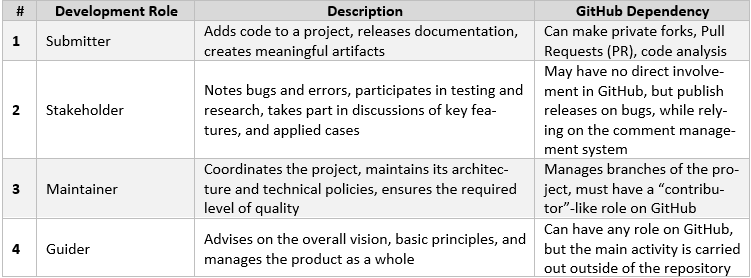

4.2 DGT Development Contributing
+++++++++++++++++++++++++++++++++++++++++

As presented in Section 1.6 `How to create Solution with DGT Networks`_, this project is publicly available and anyone interested can join it to add their own code, modify the solution for themselves, make changes, or correct errors. The core of the system - DGT CORE (`Github Repo`_) is implemented under the Apache 2.0 license, while the GARANASKA tokenization subsystem (`Github Repo_`_)is under the AGPL v3.0 license. 

.. _How to create Solution with DGT Networks: ../INTRODUCTION/1.6_How_to_Create_Solution_with_DGT_Networks.html

.. _Github Repo: https://github.com/DGT-Network/DGT-Matagami/tree/master/CORE

.. _Github Repo_: https://github.com/DGT-Network/DGT-GARANASKA

4.2.1	Development role models
=========================================

Following the tradition of free software, we can distinguish four basic roles, presented in the table below. 

4.2.2	Private Fork and Pull Request
=========================================

The main project of each version has a main GitHub branch called the “Master” or “Main”. When changes are made, an additional branch is created. The consolidation of results is done using the “Pull Request” (PR) procedure. The core procedure looks as follows: 

    •	After making changes and publishing them in their own branch (Commit changes), you can issue a Pull Request.

    •	To carry out the PR, you must be registered as a co-author of the project (GitHub Contributor). To do this, you need to send a request in any form to `partnership@dgt.world`_, where you need to introduce yourself, describe the essence of the proposed changes and your interest in the project, provide a link to a private threat, and confirm passing of tests. DGT Network has an incentive program for partners, the terms of which will be sent to you, so that you can join. By joining the project partner's team, you will also have access to the Slack group chat.

    •	To implement PR, you need to go to the “Pull Request” tab and execute the “New Pull Request” command. Then, you select the branch to be compared with the Master and after revising the proposed changes, you can execute the “Create Pull Request” command. 

    •	Report PR progress to Slack

    •	After such a request, the repository owner can accept or reject the request. Typically, PR is done within 48 business hours. If there is no response, escalate the question in the Slack chat. 

    .. _partnership@dgt.world: partnership@dgt.world

4.2.3	Code Review
=====================================

The Code Review (CR) process allows partners and the community to ensure the quality of the code and that the necessary version can be formed. The CR process is aimed towards the following questions / checks: 

•	**Functionality**. Does the new code have the necessary key features? Is the previous functionality not damaged in the process of its creation? 

•	**Tests**. Are there tests to cover the code? Are such tests sufficient to significantly reduce the risk of bugs or version crashes?

•	**Implementation quality**. Is the code you write clean? Does it follow the coding guidelines? Does it need refactoring? 

•	**Safety**. Are there any overlooked vulnerabilities or redundant dependencies that violate security or intellectual property (IP) rights?

The following possibilities are available for the implementation of CR: 

    •	Using built-in GitHub features: “give feedback.” DGT welcomes all reasonable improvements and changes. 

    •	Direct interactions with project holders, including contacting through `partnership@dgt.world`_. 

    •	Contacting the community via Slack with suggestions. 

4.2.4	Repository Owners
===================================

In case of significant contributions or opportunities for regular work, you can join the project as one of the repository owners (GitHub Maintainers). Such repository owners:

•	Represent the DGT community and participate in a dedicated DGT reward program.

•	Participate in conferences on the development of the technological policy of the product and the directions of its development. 

•	Maintain the maintainers.md registry to form the corresponding rights on GitHub.

•	Make decisions about the merging of branches and the readiness of the version for release. 

4.2.5	Build process
================================

The build process prepares the version for release and forms an adequate repository. The features of the process are as follows:

•	A build is considered unsuccessful (“failed”, “broken”) if any automated process (compilation, packaging, testing) does not execute or executes with critical errors. 

•	An unsuccessful master branch build is a critical situation; anyone who notices a build failure reports problems to `partnership@dgt.world`_, and / or in the @all Slack chat. 

•	All maintainers shall immediately make efforts to fix problems in their area of responsibility. 

•	Submitted must be available to maintainers immediately after uploading for immediate action in the case of a failed build. 

4.2.6	General coding rules
=========================================

•	Developers should strive to create idiomatic code in the language they use, in accordance with official conventions and styling. 

•	Each member of the team respects the style and contributions of other members. 

•	The DGT team respects intellectual property and makes every effort to be free from infringement. 

•	Within the team, there should be a healthy working relationship, including respect for the difference in time zones, and active interaction across all channels, including video conferences. There should be no shameful questions and each member of the team has the right to their own opinion and are guaranteed to receive respect for their work. 

•	DGT Networks will support all possible knowledge bases – Wiki, chat, design docs, …

•	Each of the participants can freely refer to the contribution they made to the project within their professional profiles, LinkedIn, resume, etc. 
