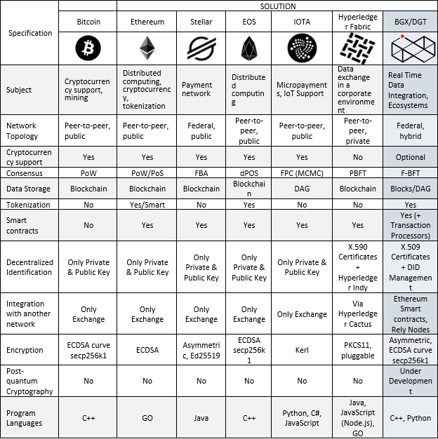

1.2 Why DGT
++++++++++++++++++

There are currently several active blockchain networks, each of which has its own characteristics. For example, the Bitcoin network is designed exclusively for supporting its eponymous cryptocur-rency, Ethereum allows for the execution of smart contracts and distributed computing, while Hyperledger Fabric allows for the implementation of private blockchain projects. The DGT Platform aims to create hybrid networks that support complex ecosystems, which vary in their security borders and are aimed towards tokenizing digital objects. These business objectives are supported by many technical characteristics, which are summarized in the table below. 

As shown above, the key distinctions of the DGT Platform are as follows:

•	the F-BFT Consensus, which is a powerful mechanism for reconciling transactions between nodes, based on a classic BFT approach, enhanced by the federated nature of the network;

•	the rejection of the peer-to-peer network makes it possible to build business-oriented groups of nodes within the general network, which in combination with F-BFT drastically increases the speed of computation and discards the disadvantages of the PoW;

•	the ability to use tokens (or optionally conducting token-free transactions) allows for the tokenization of objects, as well as significantly reduces the overhead costs of maintaining the network (for example, such as the expensive gas required to execute Ethereum smart contracts);

•	the hybrid nature of the network makes it possible to deploy both public and private segments, as well as the form private blockchain networks and configure the network topology with great flexibility; 

•	storing data in a graph-oriented structure (DAG-chain) allows for the creation of analytical tools and complex transactions. 

These features position DGT Network as an effective tool for solving various practical problems - `see 1.5`_.

.. _see 1.5: 1.5_Real_World_Application.html