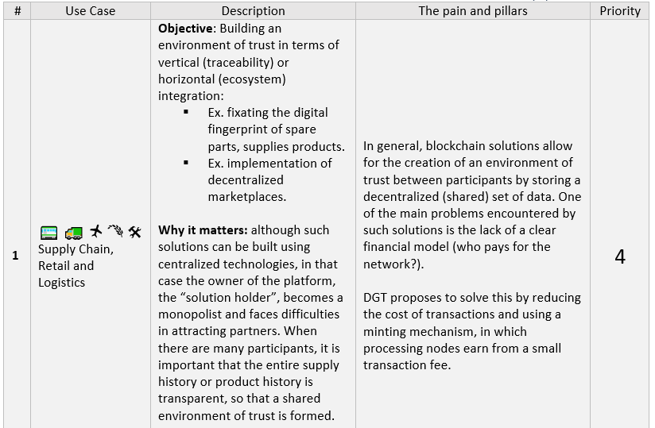

1.5 Real-World Application
++++++++++++++++++++++++++

Blockchain technology is widely used in constructing monitoring / traceability systems, distributed financial systems (DEFI), loyalty systems, ecosystems, and technical solutions related to tracking data quality. Although, in principle, any blockchain system can be adapted for these objectives, the architectural features and technologies used by DGT make it possible to form a range of preferred use cases. 

DGT best supports solutions in which:

    •	There is a complex network structure differing permissions for information access at the data level (security contours). 

    •	A hybrid solution is required that combines elements of public access with partially or fully closed networks. 

    •	The number of participants is significant, and the large volume of transactions requires high bandwidth. 

    •	There are elevated requirements for the interaction of the system with corporate applications and a need for relatively low transaction costs. 

These conditions form a list of the most preferred use cases.

.. image:: ../images/table_2_02.png
.. image:: ../images/table_2_03.png
.. image:: ../images/table_2_04.png
.. image:: ../images/table_2_05.png

The application solutions presented above do not exhaust all the possibilities of implementing the platform. For each of the solutions, serious design is required, which would include: 

    •	Representation for the data layer (with possible modification of the transaction processor). 

    •	Representation on how the system will integrate with corporate (legacy) information systems. 

    •	Development of a business plan to attract partners to a decentralized solution. 

DGT specialists are ready to provide appropriate advice and give form to the needed project. Read more on how to create your own solution based on the platform as discussed in `1.6`_.

.. _1.6: 1.6_How_to_Create_Solution_with_DGT_Networks.html

.. tip:: READ MORE: 

    •	`DGT. Supply Chain`_ - DGT's guide to developing supply chain solutions.

    .. _DGT. Supply Chain: https://dgt.world/docs/DGT_Logistics%20Marketplace.pdf

    •	`DGT. Capturing Non-Core Value. Cross-Enterprise Ecosystem`_ - description of projects for horizontal integration.  

    .. _DGT. Capturing Non-Core Value. Cross-Enterprise Ecosystem: https://dgt.world/docs/DGT_HORIZONTAL_INTEGRATION.pdf

    •	`DGT. Achieving Data-Rich Value Chains. Cross-Enterprise Integration`_ - description of projects for vertical integration.  

    .. _DGT. Achieving Data-Rich Value Chains. Cross-Enterprise Integration: https://dgt.world/docs/DGT_VERTICAL_CASE.pdf

    •	`ITU-T DLT Use Cases`_ [8] - description of application scenarios for using blockchain technology.  

    .. _ITU-T DLT Use Cases: https://www.itu.int/en/ITU-T/focusgroups/dlt/Documents/d21.pdf

    •	`EY, Tokenization of assets`_ [13] - the possibility of using blockchain technology to tokenize assets.  

    .. _EY, Tokenization of assets: https://assets.ey.com/content/dam/ey-sites/ey-com/en_ch/topics/blockchain/ey-tokenization-of-assets-broschure-final.pdf

    •	PWC, `Use Cases for Blockchain Technology in Energy & Commodity Trading`_ [14] - an overview of the application of blockchain technology in energy and commodities.  

    .. _Use Cases for Blockchain Technology in Energy & Commodity Trading: https://www.pwc.com/gx/en/industries/assets/blockchain-technology-in-energy.pdf
