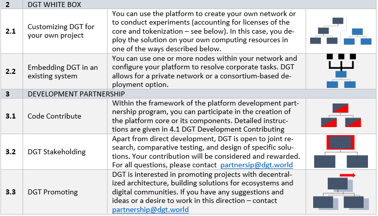

1.6 How to Create Solution with DGT Networks
++++++++++++++++++++++++++++++++++++++++++++

DGT can be used in several ways, accounting for a wide range of goals and different business models. The main list of features and their brief descriptions are presented in the table below.

When participating in the use or development of DGT, you should consider the following possibilities and limitations: 

    •	DGT is developing an open-source platform. Openness is part of our policy and philosophy, we believe that code that is available for analysis and modification allows us to consider the interests of all parties and obtain functional and safe end products. We use two licenses to facilitate the use and medication of the platform: 

        • 	The core of the system, which fully covers all the functionality of networking, distributed data synchronization, and topology settings, is implemented under the Apache 2.0 license. This means that you can use the system source code uploaded from GitHub at your own risk and completely modify it, including using it in closed proprietary projects. Although you still need to maintain a link to the original DGT project, you can create your own products. We welcome direct interaction, which gives you the opportunity to keep up with our latest developments. 

        • 	The tokenization system called GARANASKA is implemented as a separate package with the AGPL 3.0 license. This license applies to programs running in an open network environment. You can receive the source code when interacting with DGT, even without using it directly. At the same time, the tokenization systems issued on the basis of GARANASKA should be made available as open-source software for use by the community. 

    •	We do not consider it possible for DGT to participate in such closed projects, which have the purpose to create fictitious value through the efforts of the open community, deception, or infringement of the rights of individuals or entire groups. For more information on our principles and values `see 4.4`_.

    .. _see 4.4: ../COMMUNITY/4.4_Code_of_Conduct.html

    •	The product is still developing. You can get comprehensive advice on the scientific development and technological principles of the platform, which will allow you to customize your own business model. Our open roadmap is also covered in `1.7`_

    .. _1.7: 1.7_Technology_Roadmap.html

.. tip:: READ MORE: 

    •	`DGT Partnership Program`_ [18] - a presentation of the partnership concept around the DGT Platform.

    .. _DGT Partnership Program: https://dgt.world/coming-soon.html

    •	`Apache 2.0 License`_ - source text for the license under which the DGT CORE is implemented.  

    .. _Apache 2.0 License: http://www.apache.org/licenses/LICENSE-2.0

    •	`AGPL 3 (GNU Affero General Public License)`_ - license used to implement the GARANASKA token system.  

    .. _AGPL 3 (GNU Affero General Public License): https://www.gnu.org/licenses/agpl-3.0.en.html
