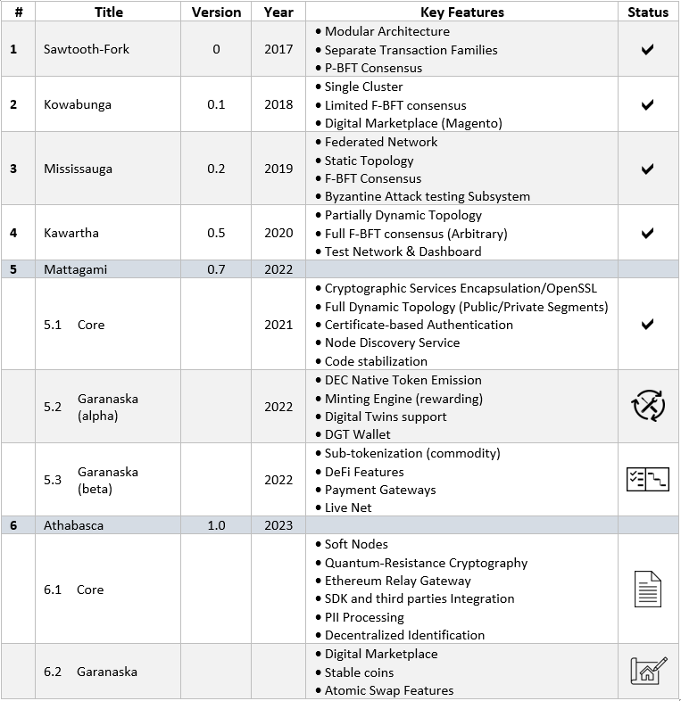

1.7	Technology Roadmap
+++++++++++++++++++++++++++

Development of the platform began in 2017 as a fork of the `Hyperledger Sawtooth`_ blockchain [20]. In the response to the requirements posed by several application tasks (i.e., creation of a distributed marketplace), there arose a need to develop a modular blockchain platform that would build up functionality iteratively. During the development process, a few fundamental technological solutions were adopted that significantly changed the composition of the platform's software, altered several key parameters, and led to the development of an independent product:

.. _Hyperledger Sawtooth: https://sawtooth.hyperledger.org/docs/core/releases/latest/introduction.html

    •	Rejection of the peer-to-peer network, the transition to its hierarchal structure, which is more in line with the ecosystem approach of the digital economy. 

    •	Transition to the F-BFT Consensus, making it possible to significantly speed up transaction processing and implement the classic BFT approach to a dynamic network. 

    •	Changes in the way the registry is stored and a transition to the graph-oriented DAG storage.

    •	Changes in the authorization and work with data to meet the requirements of Enterprise IT. 

    •	Implementation of a tokenization and minting mechanism to support the platform economy.

    •	Refactoring of the cryptography layer, support for decentralized identification. 

The main technological priorities of the DGT Platform are as follows: 
    •	An integrated security system based on the use of modern cryptography in conjunction with an end-to-end consensus mechanism. 

    •	A unified economic model that ensures the platform's operation in the Internet-of-Value paradigm (tokenization). 

    •	Openness of the technical implementation, as a guarantee of the dynamics of system development. 

    •	A combination of breakthrough technologies with verified classic IT architecture. 

The DGT Platform developed iteratively, with each iteration increasing the functionality of the previous version. The company that founded DGT is based in Canada, so the DGT versions use Canadian toponyms in the language of North American Native people as their names (Cree, Algonquins, and more). 

.. tip:: READ MORE: 

    •	`DGT Technology Roadmap`_ - the relevant development roadmap.

    .. _DGT Technology Roadmap: https://dgt.world/docs/DGT_ROADMAP.pdf

    •	`Gartner Hype Cycle for Blockchain 2021`_ - a vision for popular Blockchain technologies from the Gartner analytic company.  

    .. _Gartner Hype Cycle for Blockchain 2021: https://blogs.gartner.com/avivah-litan/2021/07/14/hype-cycle-for-blockchain-2021-more-action-than-hype/

    •	`Deloitte's 2021 Global Blockchain Survey`_ - the state of the Blockchain market from the Deloitte consulting company.  

    .. _Deloitte's 2021 Global Blockchain Survey: https://www2.deloitte.com/us/en/insights/topics/understanding-blockchain-potential/global-blockchain-survey.html
